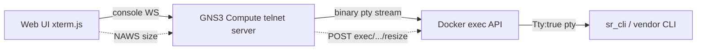

<!--
SPDX-License-Identifier: CC-BY-SA-4.0
See LICENSE file for licensing information.
-->

> This documentation is organized by AI with reference to actual code. AI can make mistakes — please verify against the source code when in doubt.


# Docker exec Console (Vendor NOS Containers)

## Overview

GNS3 Docker nodes normally expose their console by attaching to the container's
PID 1 stdio. That works for CLIs that run as PID 1 (e.g. FRR's `vtysh`), but it
does **not** work for vendor NOS containers (Nokia SR Linux, Arista cEOS,
Juniper cRPD, …) whose CLI is a separate, full-screen TUI process that is *not*
on PID 1. For those, attaching to PID 1 only shows boot logs and never yields a
CLI prompt.

The `docker_exec` console type solves this. It runs a chosen command inside the
running container via the Docker exec API (with a pty) and bridges it to the
GNS3 console, so the vendor's native TUI CLI renders in the Web UI (xterm.js)
exactly as if you had run `docker exec -it <container> <cli>` in a real
terminal.

Two companion environment knobs (`GNS3_SKIP_INIT`, `GNS3_INTERFACE_NAMES`) make
the container itself boot and wire correctly for vendor NOS images. Together
they let a vendor NOS run as a first-class GNS3 Docker router node.

> Prototype status: the knobs are environment-driven and intentionally avoid
> schema changes, so existing Docker nodes (FRR, ipterm, …) are unaffected.
> `console_type: "docker_exec"` is added to the `ConsoleType` enum.

## The three environment knobs

All three are read from the node's `environment` field. Entries prefixed with
`GNS3_` are **not** forwarded into the container (existing GNS3 behaviour), so
they stay host-side configuration.

| Variable | Purpose |
|----------|---------|
| `GNS3_SKIP_INIT=1` | Do **not** prepend `/gns3/init.sh` to the entrypoint. Vendor NOS images must run their own entrypoint (e.g. SR Linux's `sr_linux`); GNS3's init script (busybox bootstrap, `ifup`, eth wait) interferes with them. |
| `GNS3_INTERFACE_NAMES=mgmt0,e1-1,e1-2,e1-3` | Rename the injected interfaces in adapter order instead of the default `eth{N}`. SR Linux expects `mgmt0` + `e1-N`; without this it does not recognise its datapath. |
| `GNS3_CONSOLE_CMD=/opt/srlinux/bin/sr_cli` | Command run by the `docker_exec` console inside the container. |

## Architecture: `VendorDockerVM` subclass

All vendor-specific logic lives in a `VendorDockerVM(DockerVM)` subclass in
`gns3server/compute/docker/vendor_docker_vm.py` — `docker_vm.py` itself stays
on its baseline behaviour and is never touched by this feature.

`DockerVM` exposes four small extension hooks (pure refactorings, zero
behaviour change for existing nodes):

| Hook | Baseline behaviour | `VendorDockerVM` override |
|------|--------------------|---------------------------|
| `_prepare_init_and_interface_env(params)` | prepend `/gns3/init.sh`, set `GNS3_MAX_ETHERNET=eth{N-1}` | conditional init.sh (`GNS3_SKIP_INIT`), `GNS3_MAX_ETHERNET` follows the interface rename |
| `_start_console_server()` | telnet/ssh/http console dispatch | adds the `docker_exec` branch |
| `_get_container_ifname(adapter_number)` | `eth{N}` | `GNS3_INTERFACE_NAMES` lookup, fallback `eth{N}` |
| `_cleanup_console_resources()` | no-op | closes the docker-exec pty socket before restart/stop |

### Class selection

The Docker manager picks the class per node in `Docker.create_node()`
(`gns3server/compute/docker/__init__.py`):

```python
def _select_node_class(self, **kwargs):
    if kwargs.get("console_type") == "docker_exec":
        return VendorDockerVM
    return DockerVM
```

`console_type == "docker_exec"` is the **only** trigger — every other console
type (telnet, vnc, ssh, http, …) keeps using the unmodified `DockerVM`. All
vendor features are opt-in: without the `GNS3_*` environment variables a
`VendorDockerVM` instance behaves identically to `DockerVM` (init.sh still
runs, interfaces stay `eth{N}`, the exec command defaults to `/bin/sh`), so a
regular container can use `docker_exec` too.

## The `docker_exec` console type

Setting `console_type: "docker_exec"` makes the node's primary console port run
`_start_docker_exec_console()` instead of the attach-to-PID-1 path.

### Console architecture



The console uses GNS3's **existing shared/broadcast telnet model**: a single
exec instance (one CLI session) is broadcast to every console client, exactly
like the primary console shares one PID 1. There is deliberately **no
per-client session isolation** — this matches how every other GNS3 console
behaves.

### Implementation

**File**: `gns3server/compute/docker/vendor_docker_vm.py` —
`_start_docker_exec_console()`

A small subclass `_LazyExecTelnetServer(AsyncioTelnetServer)` implements the
console. Key points:

1. **Lazy exec creation.** The exec is created on the **first client
   connection** (`client_connected_hook`), not when the node starts. This is
   essential: vendor CLIs (e.g. `sr_cli` via `prompt_toolkit`) send a
   cursor-position request (`\e[6n`, CPR) during startup and block waiting for
   the terminal's answer. If the exec starts at node-start time there is no
   xterm.js client to answer, the probe times out, and the TUI degrades (no
   status bar, "Terminal doesn't support CPR" warning). Creating the exec on
   first connect means the probe runs with a real xterm.js attached, which
   answers CPR → full TUI. After creation the exec is shared by all clients.

2. **Exec API with a pty.** `POST containers/{cid}/exec` with
   `Tty: true`, `User: "root"` (vendor CLIs reject the image's default
   unprivileged user — SR Linux returns *"User 'user' is not authorized to use
   CLI"* otherwise), and `Env: ["TERM=xterm"]` (the TUI library needs a
   recognised terminal).

3. **No while-true wrapper.** The command runs as `sh -c "<cmd>"` (no
   restart loop). When the CLI exits (`quit`, the NOS's own idle timeout, or a
   crash) the exec pty closes, the broadcast task ends, and the next client
   connection **recreates** the exec (see *Reconnection*). A `while true`
   wrapper would restart the CLI mid-session with no client attached to
   answer its startup CPR probe, producing a blank/degraded screen on
   reconnect.

### Reconnection

The exec is created lazily and **recreated on reconnect if it has died**.
`client_connected_hook` checks `_upstream_alive()` (exec id set, writer open,
broadcast task not done) before each connect:

- **First connect / dead upstream** → (re)create the exec. Because a client is
  now attached, the CLI's startup CPR probe is answered by xterm.js → full
  TUI. A half-dead writer is closed first to avoid a socket leak.
- **Live upstream** → reuse the existing exec, just send `Ctrl-L` to redraw
  for the new client.

This is what makes the console survive `quit`, idle timeout, and CLI
crashes: the death is detected (pty EOF ends the broadcast task) and the
next connection spins up a fresh exec with a terminal present. The
`_LazyExecTelnetServer` is extracted to module level specifically so this
reconnect logic is unit-tested.

4. **Hijacked raw-HTTP start.** The exec is started with
   `POST exec/{eid}/start` sent as a raw HTTP upgrade over the Docker unix
   socket (`asyncio.open_unix_connection`), the same approach docker-py uses.
   This is required because aiohttp's websocket client (`ws_connect`) is
   rejected by Docker's exec-start endpoint (HTTP 400), while a raw POST
   upgrade succeeds (101). With `Tty:true` the response body is a raw,
   non-multiplexed bidirectional pty byte stream — no frame demux needed.

5. **NAWS → exec resize.** The telnet server runs with `naws=True`; the
   `window_size_changed_callback` calls `POST exec/{eid}/resize?h=&w=` so the
   TUI lays out for the xterm.js window size.

6. **Binary passthrough + redraw.** `binary=True` so TUI escape sequences reach
   xterm.js intact; `echo=False` (the pty echoes). On every client (re)connect
   a `Ctrl-L` (`\x0c`) is sent to the pty so a TUI that already drew its
   screen for a previous client redraws for the new one (otherwise a
   reconnect shows a blank screen until the next output).

**File**: `gns3server/compute/base_node.py` — the console WebSocket guard now
allows `docker_exec` (alongside `telnet`/`ssh`), since the WS bridge connects to
the console TCP port exactly as it does for telnet.

### Why earlier approaches failed (context)

- `script` + `docker exec -it`: the `script` pty had size 0 (no NAWS) → the TUI
  could not lay out → blank.
- `docker exec -i` (no `-t`) + `sr_cli -d` (dumb mode): line-mode output was
  block-buffered and visually messy.
- Direct pipe relay: telnet `CRLF` polluted line input.

The exec-API approach fixes all of these: a real pty (`Tty:true`), a real size
(NAWS resize), and a real terminal emulator (xterm.js answering CPR).

## Configuration

### SR Linux node example

```json
{
  "name": "srlinux-1",
  "node_type": "docker",
  "image": "ghcr.io/nokia/srlinux:latest",
  "adapters": 4,
  "console_type": "docker_exec",
  "start_command": "sudo -E bash -c 'touch /.dockerenv && /opt/srlinux/bin/sr_linux'",
  "environment": "GNS3_SKIP_INIT=1\nGNS3_INTERFACE_NAMES=mgmt0,e1-1,e1-2,e1-3\nGNS3_CONSOLE_CMD=/opt/srlinux/bin/sr_cli"
}
```

- `start_command` is the SR Linux launch line (as used by containerlab).
- Connect the node's ports as usual — links still use GNS3's UDP NIO datapath
  (container-agnostic); the rename only affects the in-container interface name.
- For the Web UI port **labels** to match (display `mgmt0`/`e1-1` instead of
  `Ethernet0..3`), set `custom_adapters` per port
  (`{"adapter_number": 0, "port_name": "mgmt0"}`, …). Port labels are a
  controller-side concept, independent of the compute-side interface rename.

### Persistent state

For SR Linux, persist `/etc/opt/srlinux` (config / AAA users / TLS certs) and
`/var/log/srlinux` (logs, optional) by adding them to the node's
`extra_volumes`. The image also declares its own `VOLUME` directories
(e.g. `/opt/srlinux/appmgr`), which GNS3 persists automatically.

## Volume persistence with `GNS3_SKIP_INIT`

This is the one place where skipping init.sh changes behaviour beyond boot:
`/gns3/init.sh` normally performs the volume-persistence bridge, and without it
**nothing writes through to the host** — the container writes to its overlay
filesystem and the data is lost on stop.

The bridge (see init.sh lines 35–52) has two parts:

```
host  ──Docker bind mount──▶  /gns3volumes/etc/opt/srlinux   (always mounted)
                                  │  init.sh: mount --bind
                                  ▼
                              /etc/opt/srlinux               (where the NOS writes)
```

`VendorDockerVM` replicates this for SKIP_INIT containers:

1. **`_setup_skip_init_volumes()`** — runs once per start, right after the
   container is up (`VendorDockerVM.start()`). For each persistent volume it
   `docker exec`s a busybox script that:
   - seeds the host directory with the container's original files on first
     start (`cp -a` + `.gns3_perms` marker), exactly like init.sh;
   - `mount --bind /gns3volumes<path> <path>` to bridge persistent storage
     back to the in-container path — on subsequent starts the persisted data
     replaces the fresh overlay content;
   - restores the permissions recorded in `.gns3_perms` at the previous stop
     (best-effort).

2. **Container-side `_fix_permissions()` override targeting `/gns3volumes`**
   — `DockerVM._fix_permissions` operates on the in-container paths
   (`/etc/opt/srlinux`, …), which only resolve to persistent storage while
   the `mount --bind` bridge is up; after a container restart the bridge is
   gone and it would chown the overlay copy instead of the host files. It
   also restarts an exited container just to chown. The override instead
   runs the same busybox record/chmod/chown script **inside the container
   (as root) on the `/gns3volumes<path>` paths** — the Docker bind-mount
   targets, which exist for the whole container lifetime and need no bridge.
   A stopped/exited container is **not** restarted: the pass is skipped and
   the next start fixes ownership. It runs at start (so the controller can
   read project files while the node runs) and at stop (for files written
   during runtime).

> The fix must run container-side: files written by the container are
> host-side root-owned, and an unprivileged GNS3 process cannot chown them
> from the host. Container-side root (with GNS3's `UsernsMode: host`) can.

With `GNS3_SKIP_INIT`, GNS3's hardcoded `/etc/network` volume (see
`docker_vm.py` `_mount_binds()`) is dropped entirely by
`VendorDockerVM._mount_binds()`: it holds GNS3's own network config for
init.sh's `ifup`, which never runs for SKIP_INIT containers — the NOS
manages its own interfaces. The override removes the bind, filters the
volume out of `self._volumes`, and deletes the host-side skeleton directory
the base class just created. Without `GNS3_SKIP_INIT` the mount is kept
(behaviour matches the base class).

### Lifecycle summary

| Phase | Normal Docker node | `VendorDockerVM` + `GNS3_SKIP_INIT` |
|-------|--------------------|--------------------------------------|
| start | init.sh seeds + bind-mounts + restores perms (in-container, before the app starts) | `docker exec` after start: seed + bind-mount + restore perms; then container-side chown on `/gns3volumes` |
| stop | container-side `_fix_permissions` on in-container paths (restarts an exited container) | container-side `_fix_permissions` on `/gns3volumes` paths (skips dead containers, no restart) |
| volume config | identical `_mount_binds` (host → `/gns3volumes<path>`) | identical |

### Runtime ownership safety

The start-time fix pass chowns the volume files to the host user **while the
container is running** — a deliberate deviation from the standard model, where
init.sh restores container-native ownership at start and the container never
sees host-owned files during runtime. Verified harmless for SR Linux:

1. **Most processes run as root** (`sr_linux`, appmgr) — root ignores file
   ownership entirely.
2. **Self-healing daemons.** SR Linux's `aaamgr` rewrites its managed files
   with its own ownership at boot: after the start-time pass chowned
   `etc/opt/srlinux/aaamgr_local_user.json` to the host user, the daemon
   re-created it as `srlinux:srlinux` (uid 1002, mode 700) within seconds.
3. **ACL-based access.** The directory carries a default ACL
   (`default:group:srlinux:rwx`, `default:other::rwx`), so named group ACL
   entries grant access independently of the owner uid; the observed file ACL
   (`group:srlinux:rwx`, owner `srlinux`) survives chown.

Caveat: a NOS that strictly validates ownership of its files (e.g. "SSH keys
must be root:root 600 or refuse to start") would not tolerate this. If that
ever matters, drop the start-time pass and keep only the stop-time one
(standard behaviour — the trade-off is mid-run `Permission denied` in the
file browser, identical to regular Docker nodes).

### Boot-ordering caveat

The volume bridge (`mount --bind`) is established **after** the vendor
entrypoint has started (there is no init.sh to do it before), so the NOS's
early boot reads the overlay copy of the volume paths — default image
content, not the persisted data. Whether the persisted config takes effect
depends on the NOS re-reading those files after the bridge is up (SR Linux's
daemons do re-read/write their managed files during boot, as observed).
Always verify the closed loop when adopting a new image: `save` a config →
stop the node → start it → confirm the config is actually applied, not just
present on the host.

## Troubleshooting

**1. Console shows only boot logs, no CLI**
- You are on the primary attach console. Set `console_type: "docker_exec"` and
  use `GNS3_CONSOLE_CMD` to point at the vendor CLI.

**2. `User '...' is not authorized to use CLI`**
- The exec must run as root. The implementation sets `User: "root"`; if you
  fork it, keep that.

**3. `Terminal doesn't support cursor position requests (CPR)`**
- This means the exec was started without an xterm.js client connected (the
  startup probe had no one to answer). The lazy-start design avoids this; if you
  see it, ensure the exec is created on first connect, not at node start.

**4. Reconnecting the Web console shows a blank screen**
- A `Ctrl-L` is sent on each connect to force a TUI redraw. If the TUI does not
  redraw, verify the `client_connected_hook` still writes `\x0c` to the pty.

**5. `aiohttp WSServerHandshakeError: 400` on exec start**
- Do **not** use the websocket client to start an exec. Use the hijacked raw
  HTTP upgrade over the unix socket (see Implementation).

**6. SR Linux data interfaces stay down**
- SR Linux defaults its data ports to `admin-state disable`; enable them in the
  CLI (`interface ethernet-1/1 admin-state enable`) and bind the interface to a
  network-instance before ping works. This is SR Linux behaviour, not a GNS3
  issue.

**7. "Session has been idle, will logout in 300 seconds" → Connection closed**
- SR Linux's own CLI idle timeout logs the CLI out, the exec pty closes, and
  the console disconnects. Reopening the console recreates the exec (see
  *Reconnection*) and gives a fresh login. To keep a permanent session,
  disable the timeout in the CLI: `enter candidate` →
  `/system cli idle-timeout disable` → `commit now`.

**8. Controller logs `Permission denied` reading files under the node's
   project directory while the node runs**
- Root-written files inside a persistent volume. The container-side
  `_fix_permissions` pass runs at start (fixes the seeded files) and at stop;
  files created by the container *during* runtime become readable after the
  next stop.
- Concrete example: SR Linux's `aaamgr` daemon rewrites
  `etc/opt/srlinux/aaamgr_local_user.json` during boot, **after** the
  start-time pass, as the image's `srlinux` user (uid 1002, mode 700) — so
  the host-side file stays `1002:1002` until the stop-time pass chowns it.
- The log line comes from the file-browser API chain: Web UI *Show in file
  manager* → `GET /v3/projects/{pid}/nodes/{nid}/files`
  (`controller/nodes.py:538`) → `project.list_node_files`
  (`compute/project.py:510`), where `magic.from_file()` cannot read the
  file and the `file_type` field is left empty for that entry. The MCP
  `list_node_files` tool uses the same code path. Size/modified-at fields
  and everything else keep working; only the type sniff and one warning
  line are affected — same behaviour as any regular Docker node writing
  root-owned files at runtime.

**9. Persistent volume empty on the host after `save` + stop**
- Ensure `GNS3_SKIP_INIT=1` is set (so the host-side bridge path is taken) and
  the volume path is in `extra_volumes`; check the compute log for
  `Volume '<path>' bound to persistent storage`.

**10. Persisted config present on the host but not applied after restart**
- The volume bridge is established after the NOS has booted (see
  *Boot-ordering caveat*); the NOS may have already loaded the overlay's
  default config into memory. Verify with a visible change (hostname,
  interface description): `save` → stop → start → check the change took
  effect. If it does not, the image needs the bridge earlier (a
  vendor-specific entrypoint wrapper, not covered by this prototype).

## Limitations

1. **Shared session (broadcast).** All console clients share one CLI session
   and can see each other's input — identical to GNS3's existing primary
   console model. There is no per-client independent session.
2. **`reset_console` not wired.** The console-reset action only handles
   `telnet`/`ssh`; it is a no-op for `docker_exec` (non-blocking; reconnect
   works fine).
3. **Prototype knobs.** `GNS3_SKIP_INIT` / `GNS3_INTERFACE_NAMES` /
   `GNS3_CONSOLE_CMD` are environment-driven; they are not yet first-class node
   schema fields and are not declared in the appliance (`gns3a`) schema.
4. **Rootful-Docker assumption** (`UsernsMode: host`, set for all GNS3
   Docker nodes) so the container-side chown acts on the host files' real
   uid/gid (see the volume-persistence section).
5. **Post-boot volume bridge.** The bind-mount bridge is established after the
   vendor entrypoint has started (init.sh would do it before). A NOS that
   strictly requires its persisted files at its very first read may need a
   different boot arrangement (see *Boot-ordering caveat*).

## References

- `gns3server/compute/docker/vendor_docker_vm.py` — `VendorDockerVM`:
  `_start_docker_exec_console`, `_LazyExecTelnetServer`,
  `_setup_skip_init_volumes`, container-side `_fix_permissions` on
  `/gns3volumes`, `start()`.
- `gns3server/compute/docker/docker_vm.py` — `DockerVM` extension hooks
  (`_prepare_init_and_interface_env`, `_start_console_server`,
  `_get_container_ifname`, `_cleanup_console_resources`).
- `gns3server/compute/docker/__init__.py` — `Docker._select_node_class` /
  `create_node` factory.
- `gns3server/compute/base_node.py` — console WebSocket guard.
- `gns3server/schemas/common.py` — `ConsoleType.docker_exec`.
- containerlab `nodes/srl/srl.go` — reference for SR Linux launch command and
  interface naming.

## Version History

| Version | Date | Changes |
|---------|------|---------|
| 1.4 | 2026-08-13 | Reconnect fix: drop the while-true wrapper (it restarted the CLI with no client to answer CPR → blank screen on reconnect); the exec is now recreated on connect when the upstream has died. `_LazyExecTelnetServer` extracted to module level and unit-tested. |
| 1.3 | 2026-08-12 | Document runtime ownership safety (root processes, self-healing daemons, ACL evidence for SR Linux), the boot-ordering caveat (bridge after boot → verify save/stop/start closed loop), and troubleshooting #10. |
| 1.2 | 2026-08-12 | `_fix_permissions` rewritten: container-side (as root) on the `/gns3volumes` bind-mount targets instead of host-side — host-side chown cannot touch root-owned files when GNS3 is unprivileged. Dead containers are skipped instead of restarted. |
| 1.1 | 2026-08-12 | Refactor: vendor logic extracted from `DockerVM` into `VendorDockerVM` subclass with 4 hook points + class-selection factory. Add SKIP_INIT volume persistence (`_setup_skip_init_volumes` + `_fix_permissions`) and lifecycle comparison. Add troubleshooting entries for idle timeout and permission-denied files. |
| 1.0 | 2026-08-12 | Initial documentation of the `docker_exec` console and vendor NOS knobs. |
