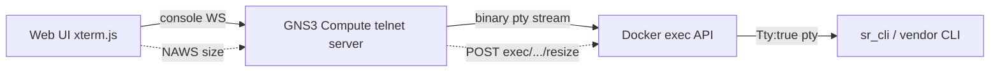

<!--
SPDX-License-Identifier: CC-BY-SA-4.0
See LICENSE file for licensing information.
-->

> This documentation is organized by AI with reference to actual code. AI can make mistakes — please verify against the source code when in doubt.


# Docker exec Console (Vendor NOS Containers)

## Overview

GNS3 Docker nodes normally expose their console by attaching to the container's
PID 1 stdio. That works for CLIs that run as PID 1 (e.g. FRR's `vtysh`), but it
does **not** work for vendor NOS containers (Nokia SR Linux, Arista cEOS,
Juniper cRPD, …) whose CLI is a separate, full-screen TUI process that is *not*
on PID 1. For those, attaching to PID 1 only shows boot logs and never yields a
CLI prompt.

The `docker_exec` console type solves this. It runs a chosen command inside the
running container via the Docker exec API (with a pty) and bridges it to the
GNS3 console, so the vendor's native TUI CLI renders in the Web UI (xterm.js)
exactly as if you had run `docker exec -it <container> <cli>` in a real
terminal.

Two companion environment knobs (`GNS3_SKIP_INIT`, `GNS3_INTERFACE_NAMES`) make
the container itself boot and wire correctly for vendor NOS images. Together
they let a vendor NOS run as a first-class GNS3 Docker router node.

> Prototype status: the knobs are environment-driven and intentionally avoid
> schema changes, so existing Docker nodes (FRR, ipterm, …) are unaffected.
> `console_type: "docker_exec"` is added to the `ConsoleType` enum.

## The three environment knobs

All three are read from the node's `environment` field. Entries prefixed with
`GNS3_` are **not** forwarded into the container (existing GNS3 behaviour), so
they stay host-side configuration.

| Variable | Purpose |
|----------|---------|
| `GNS3_SKIP_INIT=1` | Do **not** prepend `/gns3/init.sh` to the entrypoint. Vendor NOS images must run their own entrypoint (e.g. SR Linux's `sr_linux`); GNS3's init script (busybox bootstrap, `ifup`, eth wait) interferes with them. |
| `GNS3_INTERFACE_NAMES=mgmt0,e1-1,e1-2,e1-3` | Rename the injected interfaces in adapter order instead of the default `eth{N}`. SR Linux expects `mgmt0` + `e1-N`; without this it does not recognise its datapath. |
| `GNS3_CONSOLE_CMD=/opt/srlinux/bin/sr_cli` | Command run by the `docker_exec` console inside the container. |

## The `docker_exec` console type

Setting `console_type: "docker_exec"` makes the node's primary console port run
`_start_docker_exec_console()` instead of the attach-to-PID-1 path.

### Architecture



The console uses GNS3's **existing shared/broadcast telnet model**: a single
exec instance (one CLI session) is broadcast to every console client, exactly
like the primary console shares one PID 1. There is deliberately **no
per-client session isolation** — this matches how every other GNS3 console
behaves.

### Implementation

**File**: `gns3server/compute/docker/docker_vm.py` — `_start_docker_exec_console()`

A small subclass `_LazyExecTelnetServer(AsyncioTelnetServer)` implements the
console. Key points:

1. **Lazy exec creation.** The exec is created on the **first client
   connection** (`client_connected_hook`), not when the node starts. This is
   essential: vendor CLIs (e.g. `sr_cli` via `prompt_toolkit`) send a
   cursor-position request (`\e[6n`, CPR) during startup and block waiting for
   the terminal's answer. If the exec starts at node-start time there is no
   xterm.js client to answer, the probe times out, and the TUI degrades (no
   status bar, "Terminal doesn't support CPR" warning). Creating the exec on
   first connect means the probe runs with a real xterm.js attached, which
   answers CPR → full TUI. After creation the exec is shared by all clients.

2. **Exec API with a pty.** `POST containers/{cid}/exec` with
   `Tty: true`, `User: "root"` (vendor CLIs reject the image's default
   unprivileged user — SR Linux returns *"User 'user' is not authorized to use
   CLI"* otherwise), and `Env: ["TERM=xterm"]` (the TUI library needs a
   recognised terminal).

3. **Hijacked raw-HTTP start.** The exec is started with
   `POST exec/{eid}/start` sent as a raw HTTP upgrade over the Docker unix
   socket (`asyncio.open_unix_connection`), the same approach docker-py uses.
   This is required because aiohttp's websocket client (`ws_connect`) is
   rejected by Docker's exec-start endpoint (HTTP 400), while a raw POST
   upgrade succeeds (101). With `Tty:true` the response body is a raw,
   non-multiplexed bidirectional pty byte stream — no frame demux needed.

4. **NAWS → exec resize.** The telnet server runs with `naws=True`; the
   `window_size_changed_callback` calls `POST exec/{eid}/resize?h=&w=` so the
   TUI lays out for the xterm.js window size.

5. **Binary passthrough + redraw.** `binary=True` so TUI escape sequences reach
   xterm.js intact; `echo=False` (the pty echoes). On every client (re)connect
   a `Ctrl-L` (`\x0c`) is sent to the pty so a TUI that already drew its
   screen for a previous client redraws for the new one (otherwise a
   reconnect shows a blank screen until the next output).

**File**: `gns3server/compute/base_node.py` — the console WebSocket guard now
allows `docker_exec` (alongside `telnet`/`ssh`), since the WS bridge connects to
the console TCP port exactly as it does for telnet.

### Why earlier approaches failed (context)

- `script` + `docker exec -it`: the `script` pty had size 0 (no NAWS) → the TUI
  could not lay out → blank.
- `docker exec -i` (no `-t`) + `sr_cli -d` (dumb mode): line-mode output was
  block-buffered and visually messy.
- Direct pipe relay: telnet `CRLF` polluted line input.

The exec-API approach fixes all of these: a real pty (`Tty:true`), a real size
(NAWS resize), and a real terminal emulator (xterm.js answering CPR).

## Configuration

### SR Linux node example

```json
{
  "name": "srlinux-1",
  "node_type": "docker",
  "image": "ghcr.io/nokia/srlinux:latest",
  "adapters": 4,
  "console_type": "docker_exec",
  "start_command": "sudo -E bash -c 'touch /.dockerenv && /opt/srlinux/bin/sr_linux'",
  "environment": "GNS3_SKIP_INIT=1\nGNS3_INTERFACE_NAMES=mgmt0,e1-1,e1-2,e1-3\nGNS3_CONSOLE_CMD=/opt/srlinux/bin/sr_cli"
}
```

- `start_command` is the SR Linux launch line (as used by containerlab).
- Connect the node's ports as usual — links still use GNS3's UDP NIO datapath
  (container-agnostic); the rename only affects the in-container interface name.
- For the Web UI port **labels** to match (display `mgmt0`/`e1-1` instead of
  `Ethernet0..3`), set `custom_adapters` per port
  (`{"adapter_number": 0, "port_name": "mgmt0"}`, …). Port labels are a
  controller-side concept, independent of the compute-side interface rename.

### Persistent state

For SR Linux, persist `/etc/opt/srlinux` (config / AAA users / TLS certs) by
adding it to the node's `extra_volumes`. `/var/opt/srlinux` does **not** exist
on current SR Linux images; `/var/log/srlinux` holds logs (optional).

## Troubleshooting

**1. Console shows only boot logs, no CLI**
- You are on the primary attach console. Set `console_type: "docker_exec"` and
  use `GNS3_CONSOLE_CMD` to point at the vendor CLI.

**2. `User '...' is not authorized to use CLI`**
- The exec must run as root. The implementation sets `User: "root"`; if you
  fork it, keep that.

**3. `Terminal doesn't support cursor position requests (CPR)`**
- This means the exec was started without an xterm.js client connected (the
  startup probe had no one to answer). The lazy-start design avoids this; if you
  see it, ensure the exec is created on first connect, not at node start.

**4. Reconnecting the Web console shows a blank screen**
- A `Ctrl-L` is sent on each connect to force a TUI redraw. If the TUI does not
  redraw, verify the `client_connected_hook` still writes `\x0c` to the pty.

**5. `aiohttp WSServerHandshakeError: 400` on exec start**
- Do **not** use the websocket client to start an exec. Use the hijacked raw
  HTTP upgrade over the unix socket (see Implementation).

**6. SR Linux data interfaces stay down**
- SR Linux defaults its data ports to `admin-state disable`; enable them in the
  CLI (`interface ethernet-1/1 admin-state enable`) and bind the interface to a
  network-instance before ping works. This is SR Linux behaviour, not a GNS3
  issue.

## Limitations

1. **Shared session (broadcast).** All console clients share one CLI session
   and can see each other's input — identical to GNS3's existing primary
   console model. There is no per-client independent session.
2. **`reset_console` not wired.** The console-reset action only handles
  `telnet`/`ssh`; it is a no-op for `docker_exec` (non-blocking; reconnect
  works fine).
3. **Prototype knobs.** `GNS3_SKIP_INIT` / `GNS3_INTERFACE_NAMES` /
  `GNS3_CONSOLE_CMD` are environment-driven; they are not yet first-class node
  schema fields and are not declared in the appliance (`gns3a`) schema.

## References

- `gns3server/compute/docker/docker_vm.py` — `_start_docker_exec_console`,
  `_LazyExecTelnetServer`, `_add_ubridge_connection` (interface rename),
  `create()` (env parsing, skip-init, `GNS3_MAX_ETHERNET`).
- `gns3server/compute/base_node.py` — console WebSocket guard.
- `gns3server/schemas/common.py` — `ConsoleType.docker_exec`.
- containerlab `nodes/srl/srl.go` — reference for SR Linux launch command and
  interface naming.

## Version History

| Version | Date | Changes |
|---------|------|---------|
| 1.0 | 2026-08-12 | Initial documentation of the `docker_exec` console and vendor NOS knobs. |
