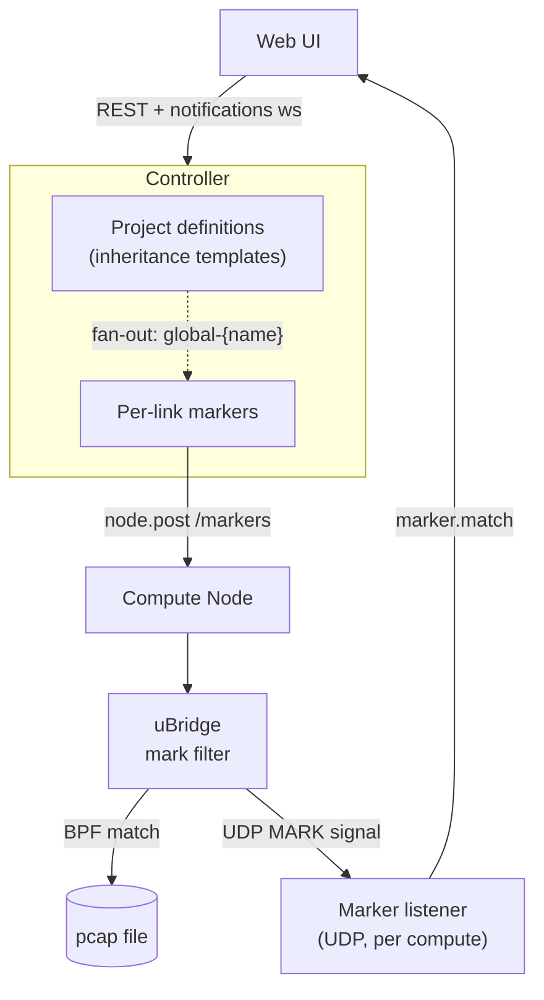
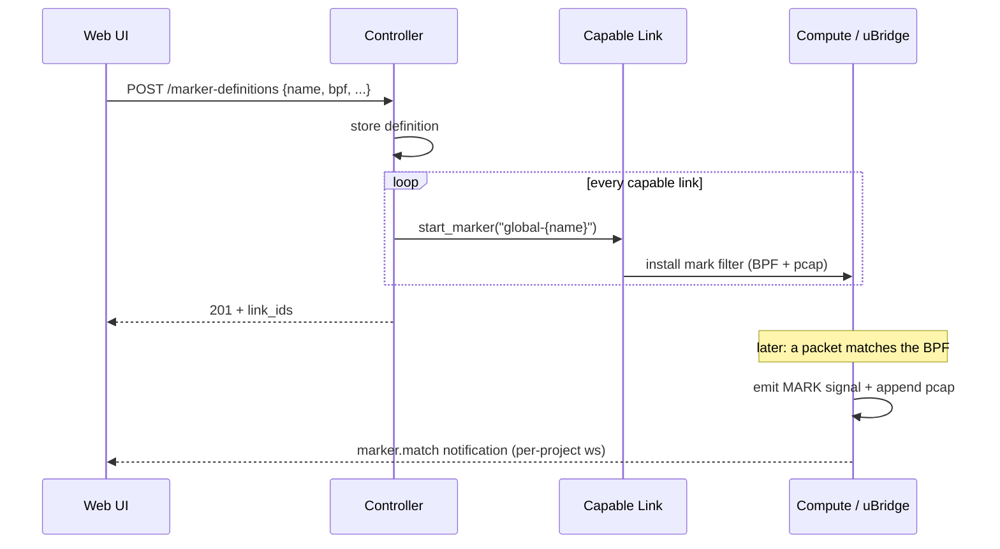

<!--
SPDX-License-Identifier: CC-BY-SA-4.0
See LICENSE file for licensing information.
-->

> This documentation is organized by AI with reference to actual code. AI can make mistakes — please verify against the source code when in doubt.

# Marker (Traffic Insight)

## Overview

A **marker** is a passive traffic-insight tap attached to a link. It runs a libpcap BPF
expression inside uBridge; on every match uBridge emits a real-time `MARK` signal and
appends the matching packet to a per-marker pcap file. Markers exist at two layers that
coexist on the same link: **per-link private markers** and **project-level definitions**
that are inherited by every capable link.

## Architecture



Inheritance is a controller-only fan-out: a definition CRUD loops over links and reuses the
existing per-link marker operations, so the compute side sees an ordinary marker and is
unchanged. Each compute process runs one UDP listener serving every uBridge on that host; the
`node` and `link` fields in each signal together identify the source link (see
[Per-link attribution](#per-link-attribution)).

## Business Process



Updating a definition syncs `bpf / tag / color / highlight_duration` to every inherited
copy; deleting a definition removes every inherited copy. A newly created link inherits all
existing definitions automatically.

## Per-link attribution

A uBridge `MARK` signal carries `node`, `filter`, `link`, `tag`, and `len` — but no bridge
name. When one node is the capture side for several links — the common case for a project-level
`global-{name}` marker on a multi-interface router — `node` + `filter` alone are identical
across those links, so they cannot tell the signals (or pcap files) apart. The `link` field
resolves this:

1. At install time the controller stamps each filter with its link id
   (`mark <bpf> [tag <id>] link <link_id> [pcap <path>]`).
2. uBridge treats `link` as opaque and echoes it verbatim in the signal (`link=<link_id>`).
3. The listener takes the signal's `link=` as the **authoritative** `link_id` of the
   `marker.match` event, falling back to its registry only for legacy signals that carry no
   `link=`.

This is also why the pcap path is keyed on link —
`<project>/markers/<node_id>_<link_id>_<filter>.pcap`, not on `bridge`+`filter`: a single
uBridge bridge can serve several links, and only the link id keeps their captures distinct.

### IOU: one bridge, many interfaces

IOU runs a single `IOL-BRIDGE` per node shared by every interface, so `bridge`+`filter` are
identical across that node's links. uBridge keeps a separate filter list **per port
(bay/unit)** within the bridge, so each interface gets its own `global-{name}` filter, its own
pcap file, and its own `link=`. The shared bridge name is irrelevant to attribution. Other
capable node types (`qemu`, `docker`, `vpcs`, `cloud`) already use one bridge per link; `link`
applies uniformly to all of them.

## Direction

A `MARK` signal optionally carries `dir=<tx|rx>` — the matched packet's travel direction
**relative to the capture node** (the `node=<id>` in the same signal, i.e. the node whose
uBridge hosts the marker):

| `dir` | Ingress NIO | Meaning |
|-------|-------------|---------|
| `tx`  | device side (`source_nio` on a generic bridge; the IOL instance on an IOU `IOL-BRIDGE`) | capture node is **sending** |
| `rx`  | link side (`destination_nio` on a generic bridge; the NIO side on an IOU `IOL-BRIDGE`) | capture node is **receiving** |

A marker is single-sided: only the chosen capture node's uBridge installs the `mark` filter,
yet both directions of the link transit that one bridge (it carries exactly two NIOs — the
device side and the link side), so that single uBridge observes and classifies both
directions. The `marker.match` event forwards `dir` through unchanged; the Web UI combines it
with the link's two endpoints and the capture `node_id` to draw an arrow:

- `dir=tx` → `capture_node → far_node`
- `dir=rx` → `far_node → capture_node`
- `dir` absent (older uBridge) → undirected highlight (current behaviour)

Because the listener ignores unknown keys, `dir` is **additive**: an older server silently
drops it and an older uBridge simply omits it — either way the system falls back to
undirected rendering with no error.

### Choosing the capture node

Since `dir` is relative to the capture node, *which* endpoint is the observer decides what
`tx`/`rx` mean. By default the server auto-picks (first started marker-capable endpoint, in
link-endpoint order). To pin it — e.g. so `dir=tx` unambiguously means "vpcs1 is sending" —
pass `capture_node_id` on marker **create**:

```json
{ "bpf": "icmp", "direction": "tx", "capture_node_id": "<vpcs1 node uuid>" }
```

The value must be one of the link's two endpoints and a marker-capable type (`vpcs`, `qemu`,
`docker`, `iou`, `dynamips`, `cloud`); any other id is rejected with `409`. Omit it to keep
the auto-pick. The chosen id is echoed back as `capture_node_id` in the marker entry and in
each `MARK` signal's `node=<id>`, so the Web UI always knows the observer regardless of who
picked it.

`capture_node_id` is **create-only**: it is fixed once the marker exists (changing the
observer would silently flip the meaning of stored `direction`, so recreate the marker
instead). It is not accepted on project-level definitions — a definition is link-agnostic and
has no endpoints to choose from, so inherited markers always auto-pick per link.

## Pause & resume

Two independent ways to silence marker activity, both instant and without an
NIO rebuild or pcap flush:

- **Per-filter toggle** — `PUT /v3/projects/{pid}/links/{lid}/markers/{name}`
  with `{"enabled": false}` flips the filter off in place (uBridge
  `enable_packet_filter … off`): no signal, no pcap, but traffic still relays —
  a paused `mark` is a no-op tap, not a drop. `{"enabled": true}` flips it back.
  A change to `enabled` alone is a single command (the pcap identity and emitted
  counter are preserved); changing `bpf` or other fields still goes through a
  reset+reapply.
- **Project-wide mute** — `POST /v3/projects/{pid}/markers/pause` and `/resume`
  issue uBridge `marker pause` / `marker resume` on every capture node. Pause
  stops signal **and** pcap but keeps the sink open, so resume is instant. Use
  for a global "mute all markers" button.

The two levers compose and do not overlap:

| Action | signal | pcap | sink |
|--------|--------|------|------|
| per-filter `enabled: false` | stop | stop | n/a |
| `marker pause` (project) | stop | stop | kept (resume instant) |
| `marker resume` (project) | resume | resume | kept |

The project-wide pause state is **persisted** in the `.gns3` file as
`markers_paused` and echoed on the project object (`GET /v3/projects/{pid}`,
the `asdict()` body), so the Web UI renders the mute button from server truth
rather than a local optimistic flag. Because `marker pause` is a uBridge
runtime flag that resets when a node restarts, `start_all` re-applies the mute
to freshly started uBridges after a project reopen — so a paused project stays
paused across close/reopen.

## API Endpoints

All endpoints require a JWT bearer token (`POST /v3/access/users/authenticate`). The
`Auth` column lists the required privilege.

### Per-link markers

| Method | Path | Description | Auth |
|--------|------|-------------|------|
| GET | `/v3/projects/{pid}/links/{lid}/markers` | List markers on a link | Link.Audit |
| POST | `/v3/projects/{pid}/links/{lid}/markers` | Attach a marker | Link.Modify |
| PUT | `/v3/projects/{pid}/links/{lid}/markers/{name}` | Update a marker | Link.Modify |
| DELETE | `/v3/projects/{pid}/links/{lid}/markers/{name}` | Remove a marker | Link.Modify |

### Project-level definitions

| Method | Path | Description | Auth |
|--------|------|-------------|------|
| GET | `/v3/projects/{pid}/marker-definitions` | List definitions + bound `link_ids` | Project.Audit |
| POST | `/v3/projects/{pid}/marker-definitions` | Create definition (fans out to every link) | Project.Modify |
| PUT | `/v3/projects/{pid}/marker-definitions/{name}` | Update definition (syncs all copies) | Project.Modify |
| DELETE | `/v3/projects/{pid}/marker-definitions/{name}` | Delete definition (clears all copies) | Project.Modify |

### Aggregation

| Method | Path | Description | Auth |
|--------|------|-------------|------|
| GET | `/v3/projects/{pid}/markers` | All markers across links, flat | Project.Audit |
| POST | `/v3/projects/{pid}/markers/pause` | Mute all markers project-wide (signal+pcap) | Project.Modify |
| POST | `/v3/projects/{pid}/markers/resume` | Resume all markers project-wide | Project.Modify |

The link object returned by `GET /v3/projects/{pid}/links[/{lid}]` also carries a `markers`
field (including inherited markers), so the Web UI can render a link's markers without an
extra request.

## Request / Response

**Marker create body** (`MarkerCreate`, shared by per-link POST and PUT):

```json
{
  "name": "icmp",
  "bpf": "icmp",
  "tag": 1,
  "direction": "tx",
  "capture_node_id": "a37e2235-e21f-46c9-a2ab-ba0f8c5465e6",
  "color": "#ff5722",
  "highlight_duration": 800,
  "enabled": true
}
```

`direction` and `capture_node_id` are both optional and create-only (see
[Direction](#direction)).

**Definition create body** (`MarkerDefinitionCreate`, shared by POST and PUT):

```json
{
  "name": "arp",
  "bpf": "arp",
  "tag": 5,
  "color": "#ff5722",
  "highlight_duration": 1200
}
```

**Marker entry** (returned by GET/POST/PUT, and the value of each link's `markers[name]`):

```json
{
  "bpf": "icmp",
  "tag": 1,
  "enabled": true,
  "color": "#ff5722",
  "highlight_duration": 800,
  "capture_node_id": "a37e2235-e21f-46c9-a2ab-ba0f8c5465e6",
  "inherited_from": null
}
```

**Definition GET response** (adds `link_ids`):

```json
{
  "arp": {
    "bpf": "arp",
    "tag": 5,
    "color": null,
    "highlight_duration": 1200,
    "link_ids": ["656ed826-...", "6bd9d156-..."]
  }
}
```

## Field Reference

### Marker entry

| Field | Type | Description |
|-------|------|-------------|
| `bpf` | string | libpcap BPF expression (required) |
| `tag` | int \| null | Correlation id echoed in `MARK` signals |
| `enabled` | bool | Whether the marker is active. Toggle is instant: `false` flips the uBridge filter off in place (no signal/pcap), `true` back on — no NIO rebuild (see [Pause & resume](#pause--resume)) |
| `color` | string \| null | Hex color render hint, e.g. `#ff5722` |
| `highlight_duration` | int \| null | UI highlight duration in ms after a match; `null` = UI default |
| `direction` | string \| null | `tx` / `rx` filter relative to the capture node; `null` = both |
| `capture_node_id` | string | Node whose uBridge hosts the marker — caller-set on create, else auto-picked |
| `inherited_from` | string | Source definition name — present on inherited markers only |

### Definition

| Field | Type | Description |
|-------|------|-------------|
| `bpf` | string | libpcap BPF expression (required) |
| `tag` | int \| null | Correlation id |
| `color` | string \| null | Hex color render hint |
| `highlight_duration` | int \| null | UI highlight duration in ms; `null` = UI default |
| `link_ids` | string[] | Links currently carrying an inherited copy (GET only) |

### Notifications

| Event | Payload | Delivered to |
|-------|---------|--------------|
| `link.updated` | Link object (its `markers` field is the source of truth) | Project notification ws |
| `marker.match` | `project_id`, `node_id`, `link_id`, `filter`, `tag`, `ts`, `len`, `dir` | Project notification ws only |

The `marker.match` `link_id` is taken from the signal's `link=` field (authoritative); see
[Per-link attribution](#per-link-attribution). The `dir` field is the matched packet's travel
direction relative to the capture node; see [Direction](#direction).

## Error Responses

| Status | Description |
|--------|-------------|
| 401 | Not authenticated |
| 404 | Link / marker / definition not found |
| 409 | Per-link edit or delete of an inherited marker; reserved (`global`) name or duplicate name on create |
| 422 | Validation failure (name format, `highlight_duration < 1`, missing `bpf`) |

## Notes

- **Marker name is immutable.** It is the identifier across the controller, the uBridge
  filter, the pcap filename, and `MARK` signal routing — so rename is a delete + recreate,
  not a field update. PUT ignores the body `name`; the `{name}` path parameter identifies
  the target, and only `bpf / tag / color / enabled / highlight_duration` are changeable.
- **`global` prefix reserved.** User-chosen names may not start with `global`; inherited
  markers are stored as `global-{definition_name}` so the two namespaces cannot collide.
  Omitting `name` on create yields an auto-generated, prefix-free name.
- **Inherited markers are read-only per-link.** PUT/DELETE on an inherited marker returns
  409 — edit them through the definitions API.
- **Render hints are not enforced.** `color` and `highlight_duration` (milliseconds, `>= 1`)
  are stored on the link and never sent to uBridge; `null` lets the UI apply its own
  default. A partial PUT (e.g. changing only `bpf`) leaves them untouched.
- **Supported node types.** A marker needs a uBridge bridge: `vpcs`, `qemu`, `docker`,
  `iou`, `dynamips`, `cloud` (one capable endpoint suffices). Types without a uBridge are
  silently skipped by the inheritance fan-out. IOU uses one shared `IOL-BRIDGE` per node but
  keeps filters, pcap files, and `link=` ids per port, so multi-interface nodes are handled
  (see [Per-link attribution](#per-link-attribution)).
- **Shared capture-side node.** When one node hosts markers for several links (typical for
  `global-*` definitions on a router), each filter is stamped with its `link_id` so signals
  and pcap files stay link-distinct; the controller never collapses them to a single link.
- **Persistence.** Definitions and private markers persist in the topology; inherited
  markers are re-created from definitions on project load, so reopening a project restores
  the same configuration and stale inherited copies cannot survive on disk.
