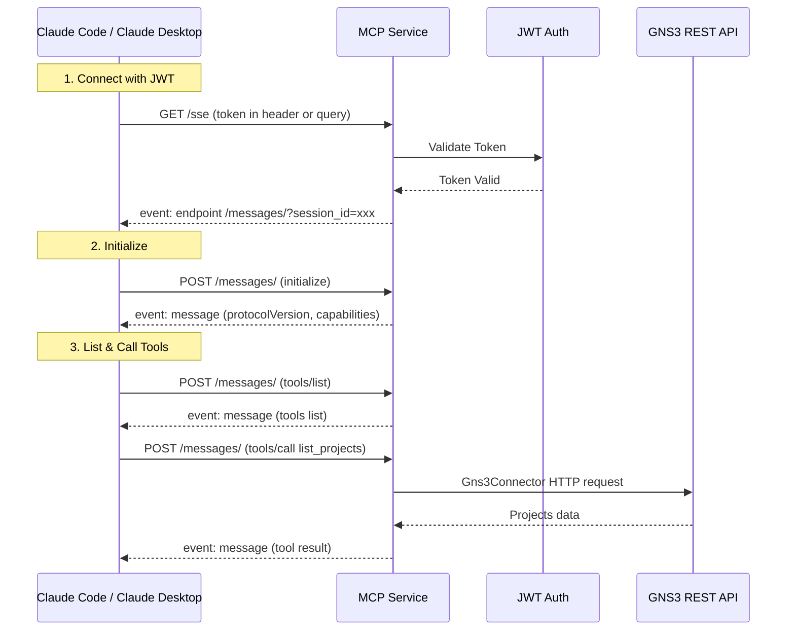

# MCP (Model Context Protocol) Service

## Overview

GNS3 Server provides a standard [Model Context Protocol (MCP)](https://modelcontextprotocol.io/) interface, allowing AI assistants like Claude to interact with GNS3 network simulations through SSE (Server-Sent Events) transport.

The MCP service exposes GNS3 project management operations as MCP tools that can be discovered and called by MCP clients.

## Endpoints

| Path | Method | Description |
|------|--------|-------------|
| `/v3/mcp/` | GET | MCP service metadata |
| `/v3/mcp/transport/sse` | GET | SSE stream (MCP connection) |
| `/v3/mcp/transport/messages/` | POST | JSON-RPC messages |

## Authentication

The SSE endpoint requires a valid GNS3 JWT token. It supports two ways to pass the token:

1. **Authorization header** (recommended for Claude Code):
   ```
   Authorization: Bearer <jwt>
   ```

2. **Query parameter** (required for Claude Desktop, since EventSource does not support custom headers):
   ```
   GET /v3/mcp/transport/sse?token=<jwt>
   ```

### Getting a Token

```bash
curl -X POST http://localhost:3080/v3/access/users/authenticate \
  -H "Content-Type: application/json" \
  -d '{"username": "admin", "password": "admin"}'
```

### Token Expiry

Default JWT token lifetime is **1440 minutes (24 hours)**. This can be configured in `gns3_server.conf`:

```ini
jwt_access_token_expire_minutes = 1440  ; 24 hours
```

## Available Tools

**30 tools** across 5 categories:

### Project (7)

| Tool | Description | Required Parameters |
|------|-------------|-------------------|
| `list_projects` | List all projects | none |
| `get_project` | Get project details | `project_id` |
| `create_project` | Create a project | `name` |
| `delete_project` | Delete a project | `project_id` |
| `open_project` | Open a project | `project_id` |
| `close_project` | Close a project | `project_id` |
| `get_project_stats` | Get project statistics | `project_id` |

### Node (10)

| Tool | Description | Required Parameters |
|------|-------------|-------------------|
| `get_nodes` | List all nodes in a project | `project_id` |
| `get_node` | Get node details | `project_id`, `node_id` |
| `start_node` | Start a node | `project_id`, `node_id` |
| `stop_node` | Stop a node | `project_id`, `node_id` |
| `reload_node` | Reload a node | `project_id`, `node_id` |
| `suspend_node` | Suspend a node | `project_id`, `node_id` |
| `create_node` | Create a node from template | `project_id`, `template_id` |
| `delete_node` | Delete a node | `project_id`, `node_id` |
| `update_node` | Update node properties | `project_id`, `node_id` |
| `get_node_console_info` | Get WebSocket console URL | `project_id`, `node_id` |

### Link (5)

| Tool | Description | Required Parameters |
|------|-------------|-------------------|
| `get_links` | List all links in a project | `project_id` |
| `get_link` | Get link details | `project_id`, `link_id` |
| `create_link` | Create a link between nodes | `project_id`, `nodes` |
| `delete_link` | Delete a link | `project_id`, `link_id` |
| `update_link` | Update link properties | `project_id`, `link_id` |

### Template (5)

| Tool | Description | Required Parameters |
|------|-------------|-------------------|
| `list_templates` | List all templates | none |
| `get_template` | Get template details | `template_id` or `name` |
| `create_template` | Create a template | `name`, `template_type` |
| `update_template` | Update a template | `template_id` or `name` |
| `delete_template` | Delete a template | `template_id` or `name` |

### Compute (3)

| Tool | Description | Required Parameters |
|------|-------------|-------------------|
| `list_computes` | List all compute nodes | none |
| `get_compute` | Get compute details | `compute_id` |
| `get_compute_images` | List available images | `emulator` |

## Configuration

### Claude Code (CLI)

```bash
# Get a JWT token
TOKEN=$(curl -s -X POST http://localhost:3080/v3/access/users/authenticate \
  -H "Content-Type: application/json" \
  -d '{"username": "admin", "password": "admin"}' | python3 -c \
  "import sys,json; print(json.load(sys.stdin)['access_token'])")

# Add MCP server
claude mcp add --transport sse My_GNS3_Server \
  http://localhost:3080/v3/mcp/transport/sse \
  -H "Authorization: Bearer $TOKEN"
```

### Claude Desktop

Add to `claude_desktop_config.json`:

```json
{
  "mcpServers": {
    "My_GNS3_Server": {
      "url": "http://localhost:3080/v3/mcp/transport/sse?token=your_jwt_token"
    }
  }
}
```

## Architecture



## Internal Implementation

- **FastMCP** (Anthropic MCP SDK) is used for tool registration and SSE transport
- The SSE app is mounted as a Starlette sub-application under `/v3/mcp/transport`
- JWT tokens are validated using GNS3's existing `auth_service`
- Tool handlers use `Gns3Connector` (from `custom_gns3fy`) to call GNS3's own REST API, keeping the MCP layer decoupled
- The JWT token is stored in a `contextvars.ContextVar` so it is available within tool handler threads (Python ≥ 3.9 propagates contextvars through `asyncio.to_thread`)

### Console WebSocket

The `get_node_console_info` tool returns a WebSocket URL for connecting to a node's console. This endpoint is protocol-agnostic — it works for **telnet**, **ssh**, and **vnc** console types alike. The WebSocket simply proxies raw byte streams between the client and the compute node; protocol negotiation (e.g. SSH key exchange) happens on the compute side.

Use `websocat` to connect from the command line:

```bash
websocat wss://host:3080/v3/projects/{project_id}/nodes/{node_id}/console/ws?token=<jwt>
```

### Source Files

| File | Purpose |
|------|---------|
| `gns3server/api/routes/mcp/__init__.py` | FastMCP server, tool decorators, SSE transport, JWT auth wrapper |
| `gns3server/api/routes/mcp/projects.py` | Project tool handlers |
| `gns3server/api/routes/mcp/nodes.py` | Node tool handlers |
| `gns3server/api/routes/mcp/links.py` | Link tool handlers |
| `gns3server/api/routes/mcp/templates.py` | Template tool handlers |
| `gns3server/api/routes/mcp/computes.py` | Compute tool handlers |
| `gns3server/api/server.py` | Mounts MCP routes via `register_starlette_routes()` |
