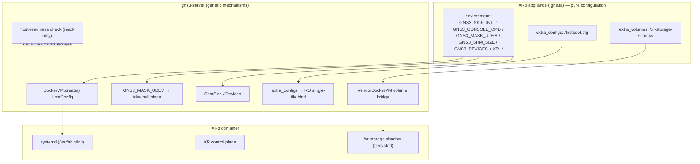

<!--
SPDX-License-Identifier: CC-BY-SA-4.0
See LICENSE file for licensing information.
-->

> This documentation is organized by AI with reference to actual code. AI can make mistakes — please verify against the source code when in doubt.


# Cisco XRd Control Plane (Vendor NOS Adaptation)

## Overview

Cisco XRd Control Plane runs as a first-class GNS3 Docker router node by
combining the existing vendor NOS path (`console_type: "docker_exec"` +
`GNS3_SKIP_INIT=1`, see [docker-exec-console.md](./docker-exec-console.md))
with four generic server mechanisms added for heavy/systemd NOS containers:
`/dev/shm` and host-device injection, config-file injection (`extra_configs`),
and udev masking. XRd itself is pure appliance configuration — no image
rebuild, no source patching.

## Why XRd must take the vendor path

XRd boots `/usr/sbin/init` (systemd) as PID 1. GNS3's generic init.sh
wrapper chain (`/gns3/init.sh → su → run-cmd.sh → /usr/sbin/init`) crashes
XRd's glibc loader with `Fatal glibc error: dl-call-libc-early-init.c:37
(sym != NULL)` (SIGABRT loop). With `GNS3_SKIP_INIT=1` the container runs
its native entrypoint directly and boots cleanly — same arrangement as
SR Linux.

## Architecture



## Mechanisms added (all generic, XRd is just the first consumer)

| Mechanism | Interface | Effect | Where |
|-----------|-----------|--------|-------|
| shm size | `GNS3_SHM_SIZE=1024` (MB) in `environment` | native `HostConfig.ShmSize` at create time — works with or without init.sh | `docker_vm.py` `create()` |
| host devices | `GNS3_DEVICES=/dev/fuse` (`docker run --device` syntax, space-separated) | native `HostConfig.Devices` | `docker_vm.py` `_format_devices()` |
| config injection | `extra_configs: [{target, content}]` (template/node/appliance schema field) | content written under the node dir, bind-mounted **read-only** at `target` — seeds NOS startup configs without rebuilding the image | `docker_vm.py` `_mount_binds()`; persisted in `docker_templates.extra_configs` (Alembic migration) |
| udev masking | `GNS3_MASK_UDEV=1` | `/dev/null` over the 5 udev systemd units **and** `/bin|/sbin|/usr/bin/udevadm` | `docker_vm.py` `create()` |
| generic unit mask | `GNS3_MASK_SYSTEMD=u1,u2` | `/dev/null` over arbitrary `/etc/systemd/system/<unit>` | `docker_vm.py` `create()` |
| host check | automatic at Docker connect | read-only `/proc` check of inotify/file-max/FUSE; warns with exact fix commands (server is unprivileged — it can only check) | `compute/docker/__init__.py` `_check_host_readiness()` |

`GNS3_*` variables are consumed host-side only and never forwarded into the
container (existing GNS3 behaviour); `XR_*` variables pass through normally.

## Host-disturbance root causes (all fixed)

A privileged systemd container can disturb the *host* desktop. Three
independent causes were isolated with plain-`docker run` A/B/C experiments
(udevd coldplug / busybox chown crash / direct `udevadm trigger`):

| Host symptom | Root cause | Fix |
|---|---|---|
| Audio muted on every node start | container `systemd-udevd` coldplug replays **all** devices it can see (privileged → host `/sys`) | `GNS3_MASK_UDEV=1` (unit masks) |
| USB reconnects (mouse notification), journal noise | XRd's own `xr_startup.sh` calls `udevadm trigger --action=add --parent-match=<usb>` (USB license-dongle probing) — a direct binary call, unit masks don't stop it | `GNS3_MASK_UDEV=1` (udevadm null-bind) |
| Same USB/journal noise + broken persistence | static busybox `chown` dlopens container NSS modules → glibc abort → per-file coredump storm → host `systemd-coredump` rescans devices | vendor volume path prefers the container's own `chown` (`vendor_docker_vm.py`) |

Diagnostics: `udevadm monitor --kernel --udev` (uevent stream),
`docker exec <cid> grep -n udevadm /opt/cisco/install-iosxr/base/etc/xr_startup.sh`.
Note: "journal corrupted" messages with varying machine-IDs come from the
*container's* journald (random machine-id per start), not the host journal.

## XRd appliance recipe

| Field | Value |
|-------|-------|
| `image` | official `ios-xr/xrd-control-plane:<ver>` — no wrapper image needed |
| `console_type` | `docker_exec` |
| `extra_volumes` | `["/xr-storage-shadow"]` |
| `extra_configs` | `{target: /firstboot.cfg, content: <XR CLI first-boot config>}` |

```
GNS3_SKIP_INIT=1
GNS3_CONSOLE_CMD=/pkg/bin/xr_cli.sh
GNS3_MASK_UDEV=1
GNS3_SHM_SIZE=1024
GNS3_DEVICES=/dev/fuse
XR_FIRST_BOOT_CONFIG=/firstboot.cfg
XR_MGMT_INTERFACES=linux:eth0,xr_name=Mg0/RP0/CPU0/0,chksum,snoop_v4,snoop_v6
XR_INTERFACES=linux:eth1,xr_name=Gi0/0/0/0;linux:eth2,xr_name=Gi0/0/0/1;...
```

XRd-specific gotchas (image-side, not GNS3):

- Management interface xr_name is **`Mg0/RP0/CPU0/0`** (short prefix, `CPU0`
  without slash). `MgmtEth0/RP0/CPU/0` is rejected: "not a valid
  rack/slot/instance/port combination".
- `XR_INTERFACES` must list exactly `adapters − 1` data interfaces (eth0 is
  management). Changing the adapter count requires regenerating the string.
- `/xr-storage` is a symlink layer; the real data directory is
  **`/xr-storage-shadow`** (`config/` `disk1/` `scratch/` `log/` — all
  `/disk0:`, `/harddisk:`, `/var/xr/*` paths converge there). Persisting
  `/xr-storage` instead copies symlinks and loses data.
- `XR_FIRST_BOOT_CONFIG` only applies when `/xr-storage-shadow/config` is
  empty (first boot). To re-seed, delete and recreate the node.
- The official image ships no default login; the first-boot config must
  create one (e.g. `username admin / group root-lr / secret ...`).
- Host sysctls (XRd's own requirements, same for containerlab):
  `fs.inotify.max_user_instances=64000`, `max_user_watches=524288`,
  `fs.file-max=1000000`, FUSE module loaded. GNS3 warns about these at
  Docker connect; the admin raises them once. XRd also warns (non-fatal)
  about `net.core.*` socket buffer sizes.

## Business process

```mermaid
sequenceDiagram
    participant U as User
    participant S as gns3-server
    participant D as Docker daemon
    participant X as XRd container
    U->>S: create node from template
    S->>S: parse GNS3_* env host-side
    S->>D: container create (ShmSize, Devices, /dev/null binds, firstboot.cfg RO bind)
    U->>S: start
    S->>X: container start (native entrypoint /usr/sbin/init)
    Note over X: systemd boots; udevd + udevadm masked → host untouched
    S->>X: docker exec volume bridge (container's own chown)
    U->>S: open console
    S->>X: docker exec pty: /pkg/bin/xr_cli.sh
    X-->>U: IOS XR CLI (first boot: apply /firstboot.cfg, save to /xr-storage-shadow)
```

## Troubleshooting

| Symptom | Cause / fix |
|---|---|
| Node exits 139, `Fatal glibc error ... sym != NULL` in logs | init.sh wrapper path — set `GNS3_SKIP_INIT=1` **and** `console_type: docker_exec` (the flag is only honoured on the vendor class) |
| `XR_FIRST_BOOT_CONFIG ... File not found` | env path and `extra_configs` target disagree (e.g. `/firstboot.cfg` vs `/first_boot.cfg`), or entry missing |
| Console stuck at `Username:` with no credentials | image has no default user; provide a first-boot config creating one, then **recreate** the node (first-boot only runs on empty config storage) |
| `Invalid interface entries ... XR_MGMT_INTERFACES` | use `xr_name=Mg0/RP0/CPU0/0` |
| Host audio muted / USB reconnects when the node starts | set `GNS3_MASK_UDEV=1` |
| Config lost across stop/start | `extra_volumes` must be `/xr-storage-shadow` |
| Two nodes can't ping, only one side ARPs | GNS3 link wiring bug (UDP self-loop on one end), not XRd — delete and re-create the link; see [link-udp-self-loop](../bugs/link-udp-self-loop.md) |
| Compute log: busybox coredump storm | fixed by the container-chown change; verify gns3-server is current |

## Notes

- All four mechanisms are opt-in: nodes that don't set the variables or the
  field get byte-identical container configuration.
- `extra_configs` is a schema field (unlike the env knobs) because the
  `environment` field is line-delimited and cannot carry multi-line file
  content.
- Template fields live in three places (pydantic schema, DB column, Alembic
  migration) — see the `extra_configs` DB migration when adding new ones.
- `net.core.*` socket-buffer requirements are not yet part of the
  host-readiness check (XRd warns about them itself, non-fatally).

## References

- `gns3server/compute/docker/docker_vm.py` — HostConfig env injection,
  `_UDEV_UNITS`/`_UDEVADM_PATHS`, `extra_configs` binds, `_format_devices()`
- `gns3server/compute/docker/vendor_docker_vm.py` — vendor path, volume
  bridge, container-chown
- `gns3server/compute/docker/__init__.py` — `_check_host_readiness()`
- `gns3server/schemas/common.py` — `ExtraConfig`
- `gns3server/db/models/templates.py` + `db_migrations/` — persistence
- [docker-exec-console.md](./docker-exec-console.md) — the vendor NOS base
  (docker_exec console, SKIP_INIT volume persistence)
- containerlab `nodes/xrd/xrd.go` — reference for XRd env defaults and
  `/xr-storage` persistence

## Version History

| Version | Date | Changes |
|---------|------|---------|
| 1.1 | 2026-08-14 | Datapath validated end-to-end (XRd brings its own interfaces up; ARP/ICMP bidirectional). Add troubleshooting entry for the one-way-link symptom (GNS3 link UDP self-loop bug, see bugs/link-udp-self-loop.md). |
| 1.0 | 2026-08-14 | Initial documentation of the XRd control-plane adaptation: vendor path requirement, shm/devices/extra_configs/udev-mask mechanisms, host-disturbance root causes, appliance recipe. |
