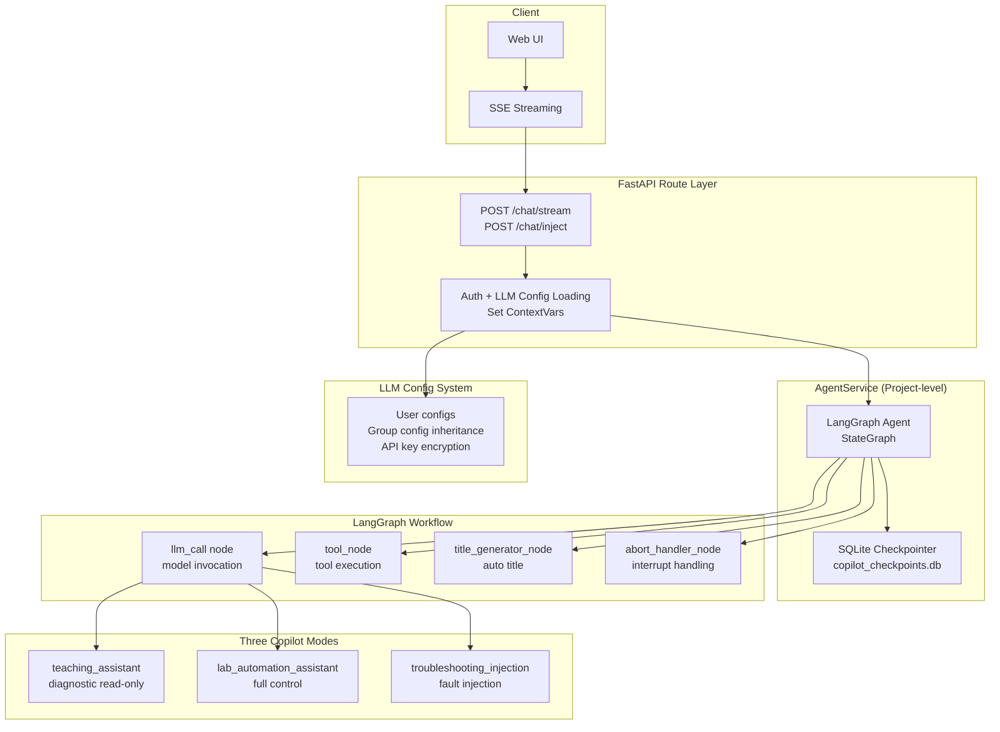
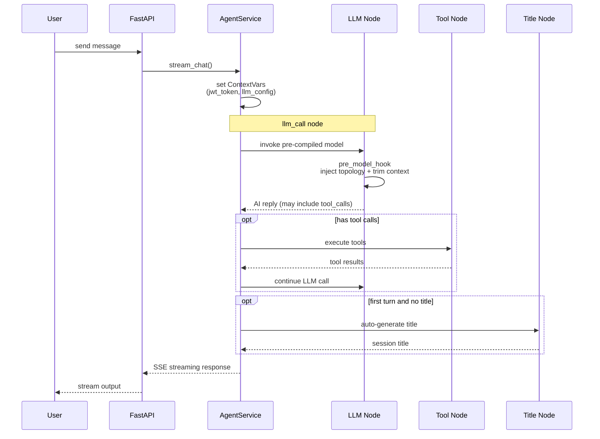
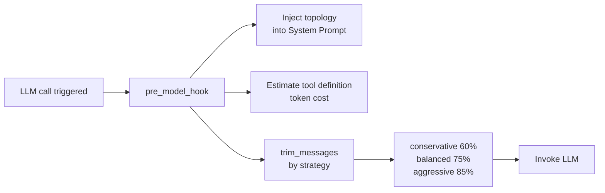

<!--
SPDX-License-Identifier: CC-BY-SA-4.0
See LICENSE file for licensing information.
-->

# GNS3-Copilot AI Assistant Overview

## Overall Architecture

## API Endpoints

| Endpoint | Function |
|---|---|
| `POST /v3/projects/{pid}/chat/stream` | Streaming conversation (SSE), supports three copilot modes |
| `POST /v3/projects/{pid}/chat/inject` | Fault injection entry, auto-switches to `troubleshooting_injection` mode |
| `GET /v3/projects/{pid}/chat/sessions` | List sessions (supports filtering, pagination) |
| `DELETE /v3/projects/{pid}/chat/sessions/{sid}` | Delete session |
| `PATCH /v3/projects/{pid}/chat/sessions/{sid}` | Update session (rename, pin) |
| `POST /v3/projects/{pid}/chat/sessions/{sid}/abort` | Abort an active session |

## LangGraph Agent Workflow

## Three Copilot Modes

### Mode Comparison

| Mode | Tool Scope | Use Case |
|---|---|---|
| `teaching_assistant` (default) | Diagnostic read-only + packet analysis + node management | Teaching demos, troubleshooting guidance |
| `lab_automation_assistant` | All tools (including config changes) | Lab automation, device configuration |
| `troubleshooting_injection` | Fault injection tool set | Troubleshooting practice, fault simulation |

### Tool Binding Details

| Tool | teaching_assistant | lab_automation_assistant | troubleshooting_injection |
|---|---|---|---|
| `GNS3TemplateTool` get templates | ✓ | ✓ | |
| `GNS3CreateNodeTool` create nodes | ✓ | ✓ | |
| `GNS3LinkTool` create links | ✓ | ✓ | |
| `GNS3StartNodeTool` start nodes | ✓ | ✓ | |
| `GNS3UpdateNodeNameTool` rename | ✓ | ✓ | |
| `GNS3StopNodeTool` stop nodes | | ✓ | |
| `GNS3SuspendNodeTool` suspend nodes | | ✓ | |
| `ExecuteMultipleDeviceCommands` read-only commands | ✓ | ✓ | ✓ |
| `ExecuteMultipleDeviceConfigCommands` config commands | | ✓ | ✓ |
| `VPCSCommands` VPCS commands | | ✓ | |
| `PacketAnalysisTool` live packet analysis | ✓ | ✓ | |
| `PacketAnalysisSkillsTool` protocol knowledge | ✓ | ✓ | |
| `DeviceSkillsTool` device skills | ✓ | ✓ | |
| `GNS3PacketFilterTool` link filters | | | ✓ |
| `InjectionSkillsTool` fault injection skills | | | ✓ |
| `GNS3TopologyTool` topology info | | | ✓ |

The mode is selected in the `llm_call` node via `copilot_mode`, which picks the corresponding tool list and binds it to the LLM model instance through `create_base_model_with_tools(mode_tools, llm_config)`.

## Context Window Management

- Accurate token counting via tiktoken (`cl100k_base`)
- Three trimming strategies: conservative / balanced / aggressive
- Auto-injects `{{topology_info}}` into System Prompt

## Session Management

- Per-project independent SQLite database (`gns3-copilot/copilot_checkpoints.db`)
- Supports pin, rename, delete, history query
- Auto-records token usage, message count, LLM call count

## LLM Config System

| Feature | Description |
|---|---|
| User-level configs | Each user can independently configure provider / model / api_key |
| Group inheritance | Users auto-inherit group config when no personal config is set |
| API key encryption | Auto-encrypted at database storage |
| Optimistic locking | `version` field prevents concurrent modification conflicts |

## Key Design Points

1. **Project-level Isolation** — Each GNS3 project has its own Agent instance and SQLite storage
2. **ContextVars Safe Passing** — JWT token, API key exist only in memory, auto-cleared when request ends
3. **LangGraph StateGraph** — Custom nodes + conditional edges, supports ReAct loop and recursion limits
4. **SSE Streaming** — Real-time push of content / tool_call / tool_start / tool_end / error / done events
5. **Hot Reload** — System Prompt, Skills, Protocols all support runtime reload
6. **Mode-based Tool Sets** — Three copilot modes bind different tools, safely isolated by scenario
