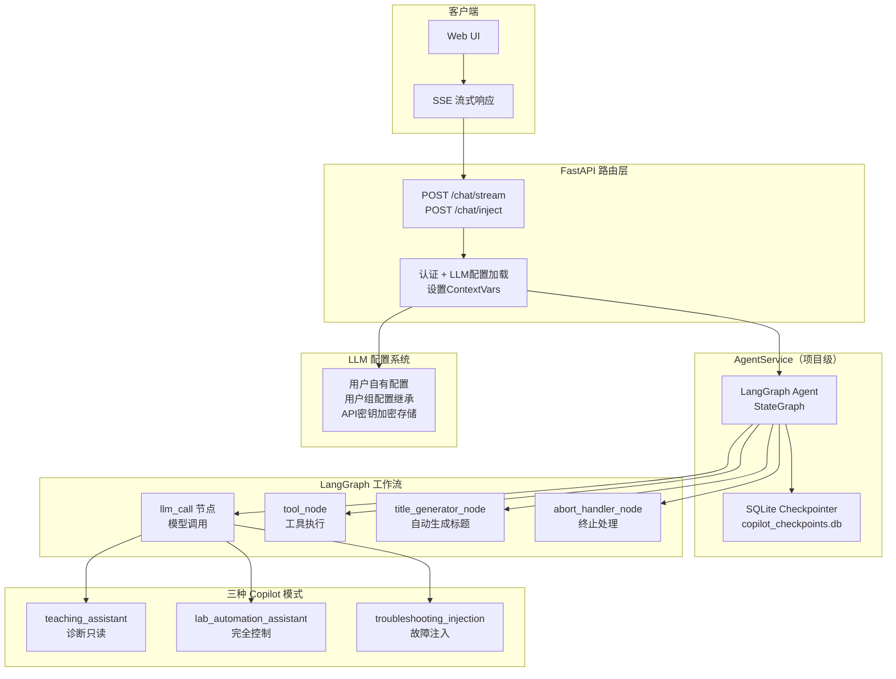
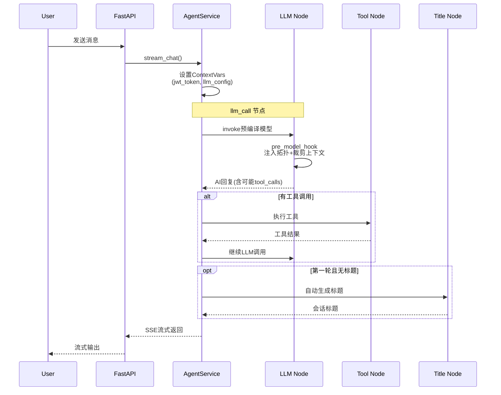
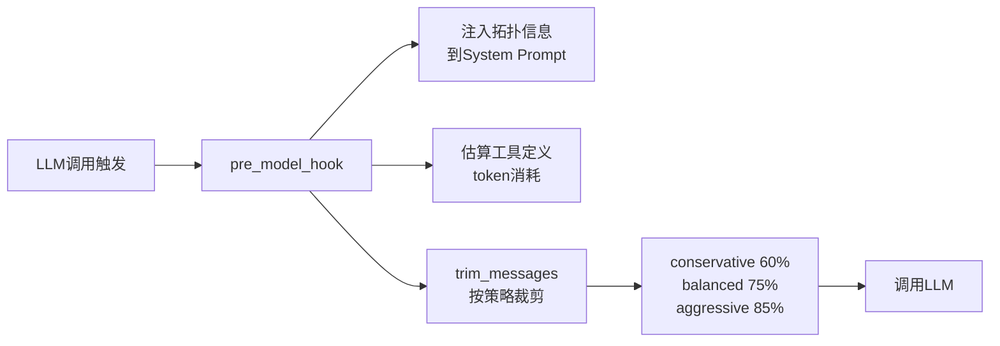

<!--
SPDX-License-Identifier: CC-BY-SA-4.0
See LICENSE file for licensing information.
-->

# GNS3-Copilot AI 助手概览

## 整体架构

## API 端点

| 端点 | 功能 |
|---|---|
| `POST /v3/projects/{pid}/chat/stream` | 流式对话（SSE），支持三种 copilot 模式 |
| `POST /v3/projects/{pid}/chat/inject` | 故障注入入口，自动切换为 `troubleshooting_injection` 模式 |
| `GET /v3/projects/{pid}/chat/sessions` | 列出会话（支持过滤、分页） |
| `DELETE /v3/projects/{pid}/chat/sessions/{sid}` | 删除会话 |
| `PATCH /v3/projects/{pid}/chat/sessions/{sid}` | 更新会话（重命名、置顶） |
| `POST /v3/projects/{pid}/chat/sessions/{sid}/abort` | 终止正在进行的会话 |

## LangGraph Agent 工作流

## 三种 Copilot 模式

### 模式对照

| 模式 | 工具范围 | 适用场景 |
|---|---|---|
| `teaching_assistant`（默认） | 诊断只读 + 数据包分析 + 节点管理 | 教学演示、故障排查指导 |
| `lab_automation_assistant` | 全部工具（含配置变更） | 实验自动化、设备配置 |
| `troubleshooting_injection` | 故障注入工具集 | 排错练习、故障模拟 |

### 工具绑定明细

| 工具 | teaching_assistant | lab_automation_assistant | troubleshooting_injection |
|---|---|---|---|
| `GNS3TemplateTool` 获取模板 | ✓ | ✓ | |
| `GNS3CreateNodeTool` 创建节点 | ✓ | ✓ | |
| `GNS3LinkTool` 创建链路 | ✓ | ✓ | |
| `GNS3StartNodeTool` 启动节点 | ✓ | ✓ | |
| `GNS3UpdateNodeNameTool` 更新名称 | ✓ | ✓ | |
| `GNS3StopNodeTool` 停止节点 | | ✓ | |
| `GNS3SuspendNodeTool` 挂起节点 | | ✓ | |
| `ExecuteMultipleDeviceCommands` 只读命令 | ✓ | ✓ | ✓ |
| `ExecuteMultipleDeviceConfigCommands` 配置命令 | | ✓ | ✓ |
| `VPCSCommands` VPCS命令 | | ✓ | |
| `PacketAnalysisTool` 实时抓包分析 | ✓ | ✓ | |
| `PacketAnalysisSkillsTool` 协议知识查询 | ✓ | ✓ | |
| `DeviceSkillsTool` 设备技能查询 | ✓ | ✓ | |
| `GNS3PacketFilterTool` 链路滤波器 | | | ✓ |
| `InjectionSkillsTool` 故障注入技能 | | | ✓ |
| `GNS3TopologyTool` 拓扑信息 | | | ✓ |

模式通过 `llm_call` 节点中的 `copilot_mode` 选择对应工具列表，调用 `create_base_model_with_tools(mode_tools, llm_config)` 将工具绑定到 LLM 模型实例。

## 上下文窗口管理

- 使用 tiktoken（`cl100k_base`）精确计数
- 三层裁剪策略：conservative / balanced / aggressive
- 自动注入 `{{topology_info}}` 到 System Prompt

## 会话管理

- 每个项目独立的 SQLite 数据库（`gns3-copilot/copilot_checkpoints.db`）
- 支持置顶、重命名、删除、历史查询
- 自动记录 token 用量、消息数、LLM 调用次数

## LLM 配置系统

| 特性 | 说明 |
|---|---|
| 用户级配置 | 每个用户可独立配置 provider / model / api_key |
| 用户组继承 | 用户未配置时自动继承所属组配置 |
| API 密钥加密 | 数据库存储时自动加密 |
| 乐观锁 | version 字段防止并发修改冲突 |

## 关键设计要点

1. **项目级隔离** — 每个 GNS3 项目拥有独立的 Agent 实例和 SQLite 存储
2. **ContextVars 安全传递** — JWT token、API key 仅存于内存，随请求结束自动清除
3. **LangGraph StateGraph** — 自定义节点 + 条件边，支持 ReAct 循环和递归限制
4. **流式 SSE** — 实时推送 content / tool_call / tool_start / tool_end / error / done 事件
5. **热重载** — System Prompt、Skills、Protocols 均支持运行时重载
6. **模式化工具集** — 三种 copilot 模式绑定不同工具组合，按场景安全隔离
