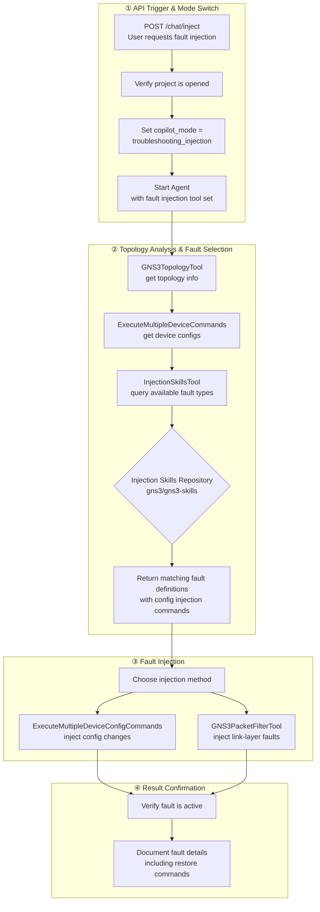
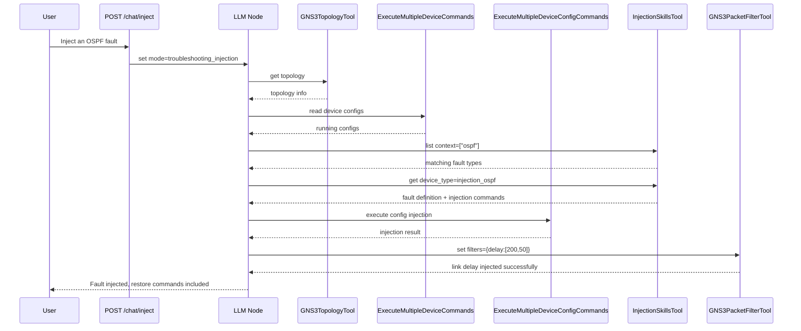

<!--
SPDX-License-Identifier: CC-BY-SA-4.0
See LICENSE file for licensing information.
-->

# GNS3-Copilot Fault Injection Overview

## Core Flow

## Tool Overview

| Tool | Source File | Purpose | Available Modes |
|---|---|---|---|
| `InjectionSkillsTool` | `registry.py` (skills module) | Query protocol-level fault definitions (config change commands) | troubleshooting_injection |
| `GNS3PacketFilterTool` | `gns3_packet_filter.py` | Link-layer fault injection (delay, loss, corruption, BPF) | troubleshooting_injection |
| `ExecuteMultipleDeviceConfigCommands` | `config_tools_nornir.py` | Batch device config changes | troubleshooting_injection |
| `ExecuteMultipleDeviceCommands` | `display_tools_nornir.py` | Read device configurations (read-only) | troubleshooting_injection |
| `GNS3TopologyTool` | `gns3_client` | Get project topology information | troubleshooting_injection |

## Fault Injection API

| Endpoint | Function |
|---|---|
| `POST /v3/projects/{pid}/chat/inject` | Trigger fault injection, sets `troubleshooting_injection` mode then starts Agent |

**Prerequisite**: Project must be in `opened` status, otherwise returns 403.

## GNS3PacketFilterTool Link Filters

| Filter Type | Function | Parameters |
|---|---|---|
| `delay` | Latency + jitter | `[latency(0-32767), jitter(0-32767)]` |
| `packet_loss` | Packet loss percentage | `[chance(0-100)]` |
| `corrupt` | Packet corruption percentage | `[chance(0-100)]` |
| `frequency_drop` | Drop every Nth packet | `[frequency(-1~32767)]` |
| `bpf` | Berkeley Packet Filter | expression text |

## Agent Workflow (LangGraph)

## Key Design Points

1. **Dedicated API Endpoint** — `POST /chat/inject` is the dedicated entry point, automatically switching to `troubleshooting_injection` mode
2. **LLM-driven Fault Selection** — The LLM analyzes the topology then queries matching faults via `InjectionSkillsTool`; no hardcoded fault scenarios
3. **Dual-Layer Injection** — Device-level config changes + link-level network impairment, covering complete troubleshooting scenarios
4. **Fully Reversible** — Every injection includes restore commands; link filters can be cleared with `action: clear`
5. **Safety First** — BPF syntax is pre-validated via tshark; config commands are restricted by `command_filter`
6. **Context Filtering** — `InjectionSkillsTool` requires a `context` parameter, returning only faults matching the topology protocols
