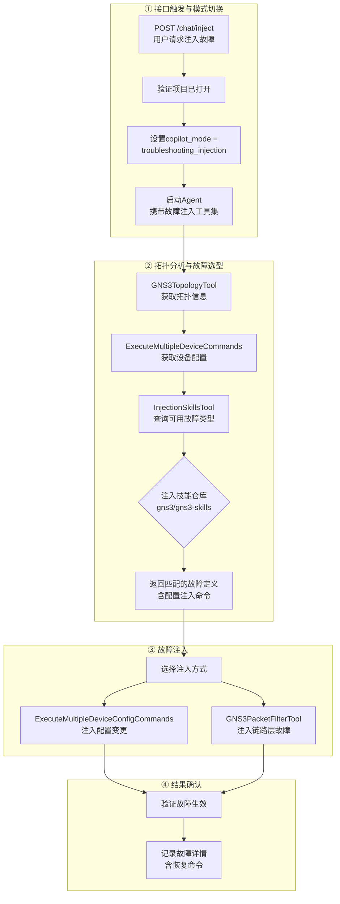
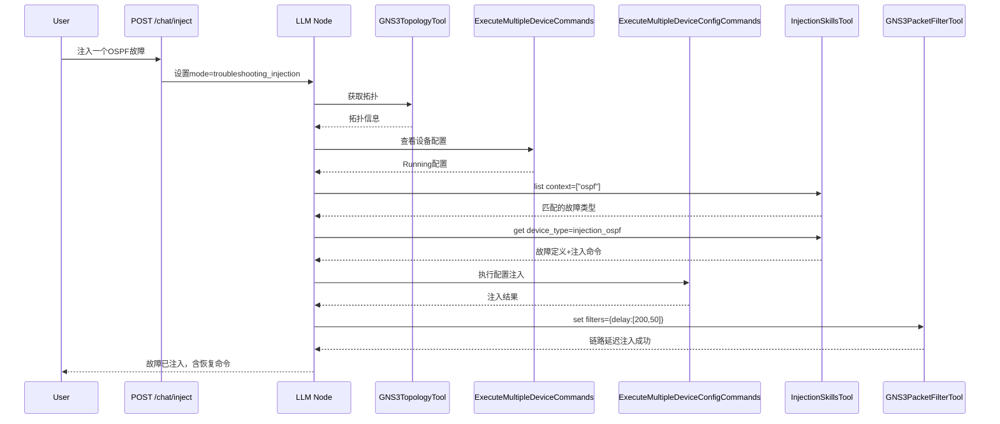

<!--
SPDX-License-Identifier: CC-BY-SA-4.0
See LICENSE file for licensing information.
-->

# GNS3-Copilot 故障注入概览

## 核心流程

## 工具总览

| 工具 | 源文件 | 作用 | 可用模式 |
|---|---|---|---|
| `InjectionSkillsTool` | `registry.py`（skills 模块） | 查询协议级故障定义（配置变更命令） | troubleshooting_injection |
| `GNS3PacketFilterTool` | `gns3_packet_filter.py` | 链路层故障注入（延迟、丢包、损坏、BPF） | troubleshooting_injection |
| `ExecuteMultipleDeviceConfigCommands` | `config_tools_nornir.py` | 批量执行设备配置变更 | troubleshooting_injection |
| `ExecuteMultipleDeviceCommands` | `display_tools_nornir.py` | 读取设备配置（只读） | troubleshooting_injection |
| `GNS3TopologyTool` | `gns3_client` | 获取项目拓扑信息 | troubleshooting_injection |

## 故障注入 API

| 端点 | 功能 |
|---|---|
| `POST /v3/projects/{pid}/chat/inject` | 触发故障注入，设置 `troubleshooting_injection` 模式后启动 Agent |

**前置条件**：项目必须为 `opened` 状态，否则返回 403。

## GNS3PacketFilterTool 链路滤波器

| 滤波器类型 | 功能 | 参数 |
|---|---|---|
| `delay` | 延迟 + 抖动 | `[latency(0-32767), jitter(0-32767)]` |
| `packet_loss` | 丢包率 | `[chance(0-100)]` |
| `corrupt` | 包损坏率 | `[chance(0-100)]` |
| `frequency_drop` | 每 N 包丢弃一个 | `[frequency(-1~32767)]` |
| `bpf` | Berkeley Packet Filter | 表达式文本 |

## Agent 工作流（LangGraph）

## 关键设计要点

1. **专用 API 入口** — `POST /chat/inject` 端点专门用于故障注入，自动切换为 `troubleshooting_injection` 模式
2. **LLM 主导故障选型** — LLM 分析拓扑后通过 `InjectionSkillsTool` 查询匹配协议栈的故障，不硬编码故障场景
3. **双层注入** — 设备级配置变更 + 链路级网络损伤，覆盖完整排错场景
4. **故障可逆** — 每条注入均附带恢复命令，链路滤波器可通过 `action: clear` 一键清除
5. **安全前置** — BPF 语法通过 tshark 预验证，配置命令受 `command_filter` 限制
6. **上下文过滤** — `InjectionSkillsTool` 强制要求传入 `context` 参数，只返回与拓扑协议匹配的故障
