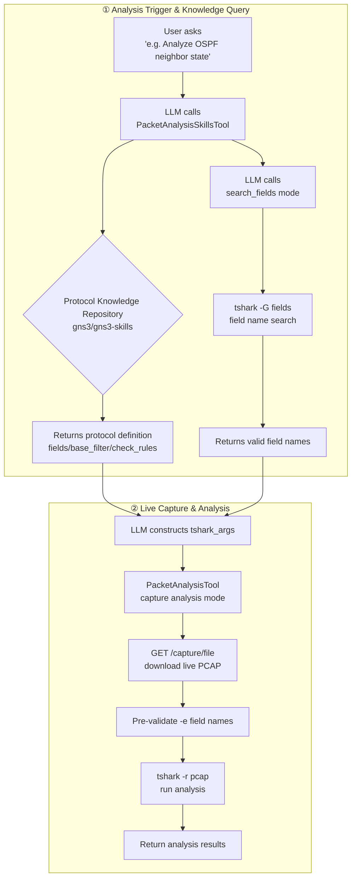
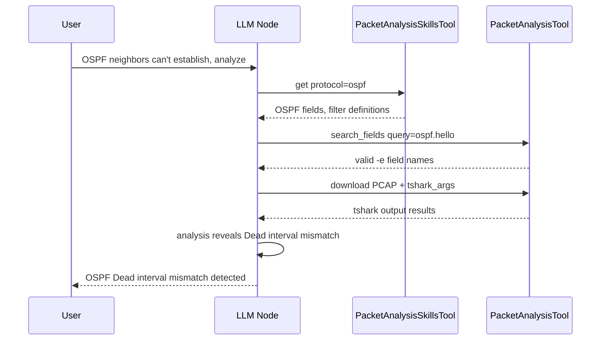

<!--
SPDX-License-Identifier: CC-BY-SA-4.0
See LICENSE file for licensing information.
-->

# GNS3-Copilot Real-time Packet AI Analysis Overview

## Core Flow

## Tool Overview

| Tool | Source File | Purpose | Available Modes |
|---|---|---|---|
| `PacketAnalysisTool` | `packet_analysis_tool.py` | Download live PCAP + tshark analysis | teaching / lab_automation |
| `PacketAnalysisSkillsTool` | `registry.py` (skills module) | Query protocol-level analysis knowledge (fields, filters) | teaching / lab_automation |

## Agent Workflow (LangGraph)

## Server Capture API

| Endpoint | Function |
|---|---|
| `POST /v3/projects/{pid}/links/{lid}/capture/start` | Start packet capture on a link |
| `POST /v3/projects/{pid}/links/{lid}/capture/stop` | Stop packet capture |
| `GET /v3/projects/{pid}/links/{lid}/capture/file` | Download PCAP file (available even while capture is active) |
| `GET /v3/projects/{pid}/links/{lid}/capture/stream` | Stream PCAP data |
| `WS /v3/projects/{pid}/links/{lid}/capture/web-wireshark` | Web Wireshark WebSocket proxy |

## Key Design Points

1. **LLM-driven Analysis** — The LLM constructs tshark parameters itself; the framework does not hardcode protocol logic, only performs safety validation
2. **Live PCAP** — Captures can be downloaded and analyzed while running, no need to stop capturing
3. **Dual Knowledge Sources** — External repository provides protocol-specific knowledge; local tshark field registry provides exact field names
4. **Safety First** — Pre-validation of tshark field names prevents execution failures from invalid fields
