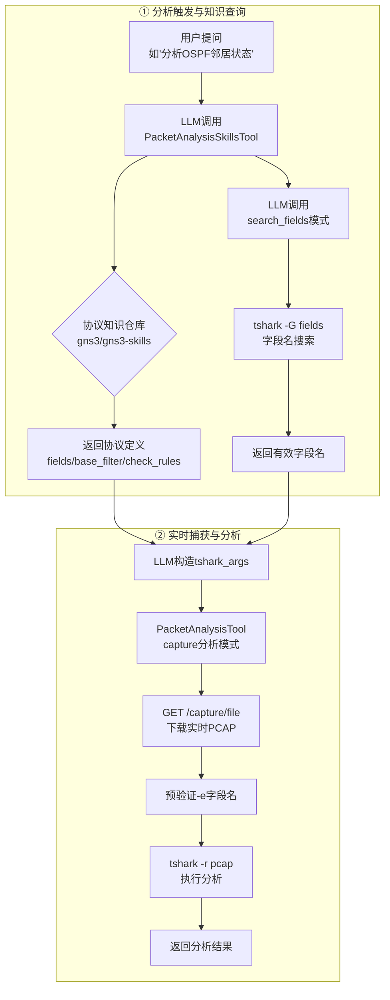
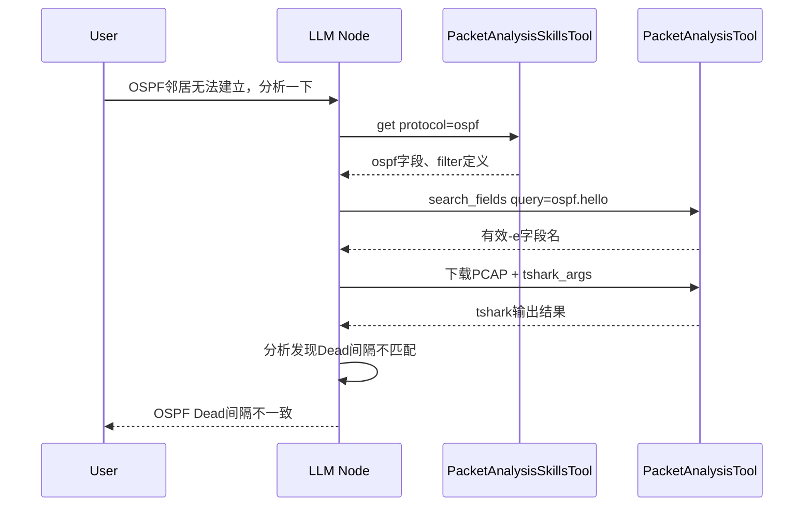

<!--
SPDX-License-Identifier: CC-BY-SA-4.0
See LICENSE file for licensing information.
-->

# GNS3-Copilot 实时数据包 AI 分析架构

## 核心流程

## 工具总览

| 工具 | 源文件 | 作用 | 可用模式 |
|---|---|---|---|
| `PacketAnalysisTool` | `packet_analysis_tool.py` | 下载实时 PCAP + tshark 分析 | teaching / lab_automation |
| `PacketAnalysisSkillsTool` | `registry.py`（skills 模块） | 查询协议级分析知识（字段、过滤规则） | teaching / lab_automation |

## Agent 工作流（LangGraph）

## 服务端 Capture API

| 端点 | 功能 |
|---|---|
| `POST /v3/projects/{pid}/links/{lid}/capture/start` | 启动链路上的数据包捕获 |
| `POST /v3/projects/{pid}/links/{lid}/capture/stop` | 停止捕获 |
| `GET /v3/projects/{pid}/links/{lid}/capture/file` | 下载 PCAP 文件（捕获进行中也可下载） |
| `GET /v3/projects/{pid}/links/{lid}/capture/stream` | 流式传输 PCAP 数据 |
| `WS /v3/projects/{pid}/links/{lid}/capture/web-wireshark` | Web Wireshark WebSocket 代理 |

## 关键设计要点

1. **LLM 主导分析** — LLM 自行构造 tshark 参数，框架不做协议硬编码，只做安全验证
2. **实时 PCAP** — 捕获运行时即可下载分析，无需停止抓包
3. **双重知识源** — 外部仓库提供协议预定义知识，本地 tshark field registry 提供精确字段名
4. **安全前置** — tshark 字段名预验证，避免无效字段导致执行失败
