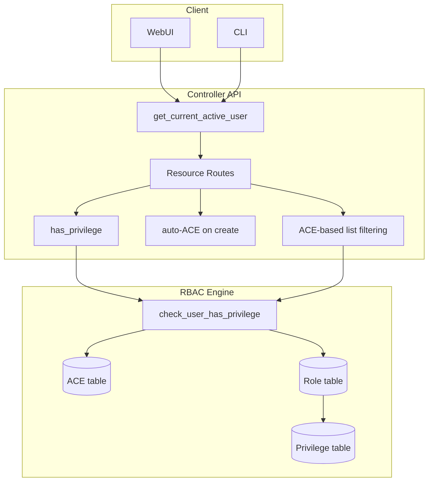
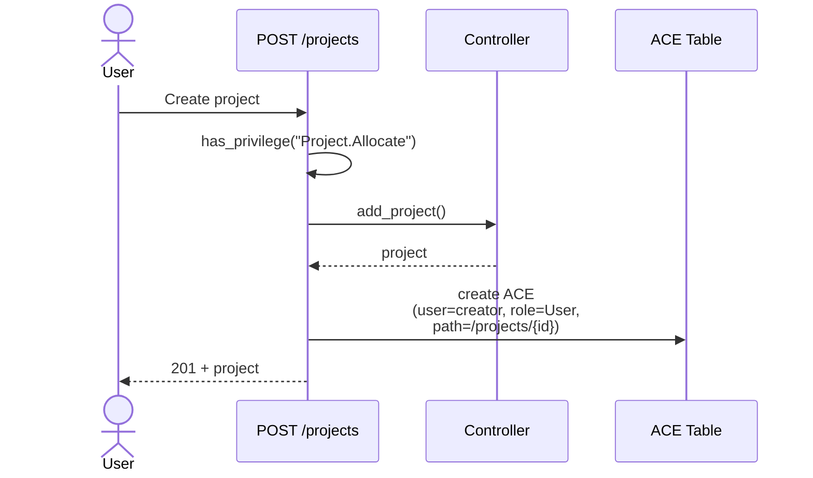
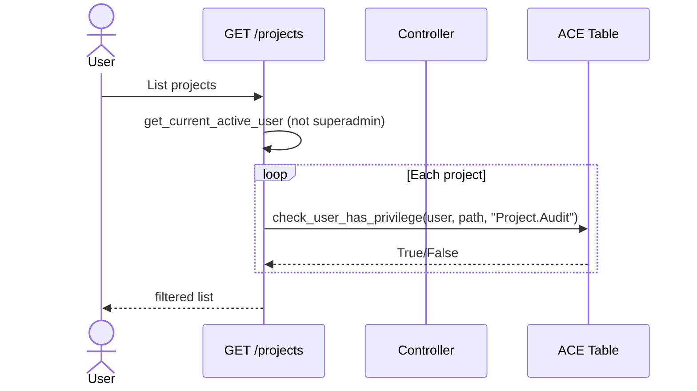

# RBAC User Isolation Roadmap

## Overview

GNS3 3.0 ships with a complete RBAC framework (ACE + Role + Privilege models), but the user isolation layer is incomplete. Users can see resources they should not have access to because:

- Resource creation does not auto-grant the creator an ACE
- List endpoints return unfiltered results
- Two GET endpoints have RBAC checks bypassed via FIXME

This document tracks the incremental work to close those gaps. Each phase is independent and deployable.

## Current State

| Resource | Route Check | List Filtering | Auto-ACE on Create | ACE Cleanup on Delete |
|---|---|---|---|---|
| Project | `Project.Audit/Modify/Allocate` | Partial — pool isolation exists but non-pool projects leak | **Missing** | Done |
| Template | `Template.Audit` **FIXME** | None — all templates returned | **Missing** | Done |
| Node | `Node.Audit/Modify/Allocate` | N/A (inherits project) | Inherits project | N/A |
| Link | `Link.Audit/Modify/Allocate` | N/A (inherits project) | Inherits project | N/A |
| Drawing | `Drawing.Audit/Modify/Allocate` | N/A (inherits project) | Inherits project | N/A |
| Snapshot | `Snapshot.Audit/Allocate/Restore` | N/A (inherits project) | Inherits project | N/A |
| Image | `Image.Audit/Allocate` | None — all images returned | **Missing** | Missing |
| Compute | `Compute.Audit` **FIXME** | None — all computes returned | N/A (shared infra) | Done |
| Appliance | `Appliance.Audit/Allocate` | None — all appliances returned | N/A (builtin) | N/A |
| Symbol | `Symbol.Audit/Allocate` | None — all symbols returned | N/A (builtin) | N/A |

## Architecture

## Business Process

### Project creation with auto-ACE

### Project listing with ACE filtering

## Phased Plan

### Phase 1 — MVP: Project isolation

**Goal**: Users only see projects they created or were granted access to.

| Task | Files | Detail |
|---|---|---|
| Auto-ACE on project create | `projects.py` — `create_project()` | After `add_project()`, create ACE: user=creator, role=User, path=`/projects/{id}` |
| Fix project list filtering | `projects.py` — `get_projects()` | Remove "sees all non-pool projects" path. Return only projects passing ACE check. |

**Estimate**: 2 files, ~30 lines changed.

### Phase 2 — Template isolation

**Goal**: Users see their own templates + builtin templates only.

| Task | Files | Detail |
|---|---|---|
| Auto-ACE on template create | `templates.py` — `create_template()` | Same pattern as project |
| Fix template list filtering | `templates.py` — `get_templates()` | Filter by ACE; builtin templates always visible |
| Uncomment `Template.Audit` | `templates.py` lines 75, 167 | Restore `has_privilege("Template.Audit")` |

**Dependency**: Web UI must handle 403 from `GET /templates/{id}`. Mitigation: keep builtin templates unconditionally visible so the UI always has data.

### Phase 3 — Image isolation (optional)

**Goal**: Users see only images they uploaded.

| Task | Files |
|---|---|
| Auto-ACE on image upload | `images.py` — `upload_image()` |
| Fix image list filtering | `images.py` — `get_images()` |
| ACE cleanup on delete | `images.py` — `delete_image()` |

### Phase 4 — Default ACE for "Users" group (optional)

**Goal**: Users in "Users" group can create/list resources without admin ACE intervention.

| Task | Detail |
|---|---|
| Default ACE on `/projects` | Grant "Users" group → User role → `/projects` (propagate=False) |
| Default ACE on `/templates` | Grant "Users" group → User role → `/templates` (propagate=False) |

## API Endpoints Changed

### Phase 1

| Method | Path | Change |
|---|---|---|
| `POST` | `/v3/projects` | Auto-create ACE for creator |
| `GET` | `/v3/projects` | Filter by user ACEs |

### Phase 2

| Method | Path | Change |
|---|---|---|
| `POST` | `/v3/templates` | Auto-create ACE for creator |
| `GET` | `/v3/templates` | Filter by user ACEs + builtin |
| `GET` | `/v3/templates/{id}` | Restore `Template.Audit` check |

## Design Decisions

1. **Compute stays shared**: Computes are infrastructure, not user-owned. The `Compute.Audit` FIXME stays — all authenticated users see computes.

2. **No DB migration required**: All phases use the existing ACE/role/privilege tables. No schema changes.

3. **Performance**: Project list filtering is O(n) — iterates all projects and checks ACE per project. Acceptable for < 500 projects. Can optimize later with direct ACE path queries.

4. **The FIXME dependency**: `Template.Audit` was commented out because web UI crashes on 403. Fix requires either (a) auto-ACE so users own their templates, or (b) web UI 403 handling.

## References

- Discussion: https://github.com/GNS3/gns3-server/discussions/1949
- RBAC models: `gns3server/db/models/acl.py`, `roles.py`, `privileges.py`
- RBAC repository: `gns3server/db/repositories/rbac.py`
- Auth dependency: `gns3server/api/routes/controller/dependencies/authentication.py`
- RBAC dependency: `gns3server/api/routes/controller/dependencies/rbac.py`
