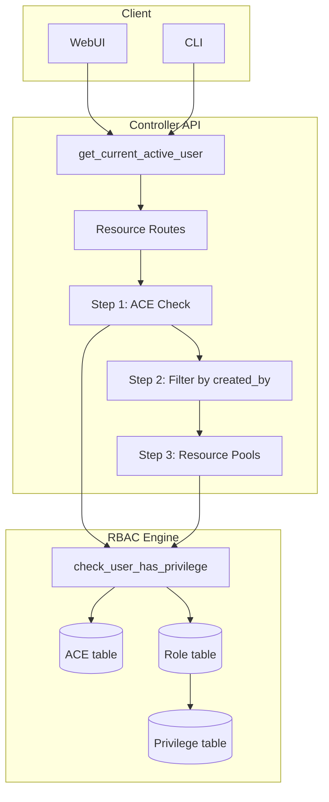
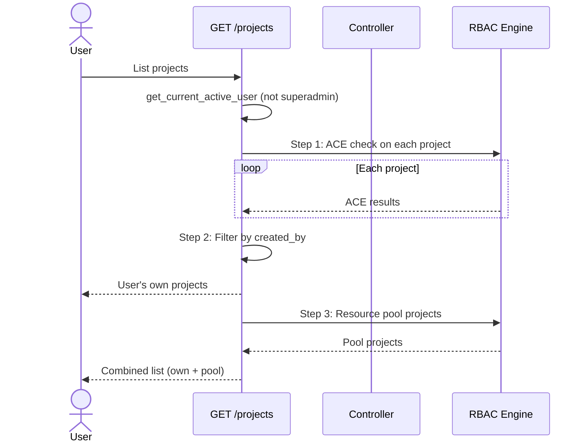

# RBAC User Isolation Roadmap

## Overview

GNS3 3.0 ships with a complete RBAC framework (ACE + Role + Privilege models), but the user isolation layer is incomplete. Users can see resources they should not have access to because:

- Resource creation does not auto-grant the creator an ACE
- List endpoints return unfiltered results
- Two GET endpoints have RBAC checks bypassed via FIXME

**This document has been updated to reflect the implemented solution in `feature/simple-user-isolation` branch.**

## Current State

| Resource | Route Check | List Filtering | Auto-ACE on Create | ACE Cleanup on Delete |
|---|---|---|---|---|
| Project | `Project.Audit/Modify/Allocate` | **Implemented** — Three-step filtering | **Not needed** | Done |
| Template | `Template.Audit` **FIXME** | None — all templates returned | **Missing** | Done |
| Node | `Node.Audit/Modify/Allocate` | N/A (inherits project) | Inherits project | N/A |
| Link | `Link.Audit/Modify/Allocate` | N/A (inherits project) | Inherits project | N/A |
| Drawing | `Drawing.Audit/Modify/Allocate` | N/A (inherits project) | Inherits project | N/A |
| Snapshot | `Snapshot.Audit/Allocate/Restore` | N/A (inherits project) | Inherits project | N/A |
| Image | `Image.Audit/Allocate` | None — all images returned | **Missing** | Missing |
| Compute | `Compute.Audit` **FIXME** | None — all computes returned | N/A (shared infra) | Done |
| Appliance | `Appliance.Audit/Allocate` | None — all appliances returned | N/A (builtin) | N/A |
| Symbol | `Symbol.Audit/Allocate` | None — all symbols returned | N/A (builtin) | N/A |

## Implemented Solution: Project Isolation

### Three-Step Permission Check Logic

**Status**: ✅ Implemented in `feature/simple-user-isolation` branch

```python
# Step 1: ACE check - basic access permission
# Get projects user has ACE for
ace_projects = []
for project in controller.projects.values():
    project_path = f"/projects/{project.id}"
    if await rbac_repo.check_user_has_privilege(current_user.user_id, project_path, "Project.Audit"):
        ace_projects.append(project)

# Step 2: Filter ace_projects by created_by - user's own projects
# Project sharing is only available through resource pools
user_projects = [p.asdict() for p in ace_projects if p.created_by == current_user.username]
projects.extend(user_projects)

# Step 3: Resource pool projects
# Projects shared through resource pools
user_pool_resources = await rbac_repo.get_user_pool_resources(current_user.user_id, "Project.Audit")
project_ids_in_pools = [str(r.resource_id) for r in user_pool_resources if r.resource_type == "project"]
pool_projects = [p.asdict() for p in controller.projects.values() if p.id in project_ids_in_pools]
projects.extend(pool_projects)
```

### Key Design Principles

1. **ACE for basic access control**: Controls whether user can access the system
2. **created_by for user isolation**: Controls which specific resources user can access
3. **Resource pools for project sharing**: The only mechanism for sharing projects between users
4. **No direct ACE sharing**: Users cannot configure ACE directly on specific projects to share them

### Advantages of This Approach

- **Fault tolerance**: Even with broad ACE configuration (`path: "/" + propagate: true`), user isolation remains effective
- **Clear separation**: Basic access, data ownership, and team sharing are clearly separated
- **Simple mechanism**: No complex auto-ACE or seen_project_ids tracking required
- **Performance**: Leverages existing created_by field, no schema changes needed

## Updated Architecture



## Business Process

### Project listing with three-step filtering



## Updated Phased Plan

### ✅ Phase 1 — MVP: Project isolation (COMPLETED)

**Goal**: Users only see projects they created or were granted access to through resource pools.

| Task | Files | Status | Detail |
|---|---|---|---|
| Fix project list filtering | `projects.py` — `get_projects()` | ✅ **Implemented** | Three-step filtering: ACE check → created_by filter → resource pools |

**Result**: 
- ✅ Users can only see projects they created
- ✅ Team collaboration through resource pools works
- ✅ Fault tolerance: Works correctly even with broad ACE configurations
- ✅ No schema changes required
- ✅ ~30 lines changed

### Phase 2 — Template isolation

**Goal**: Users see their own templates + builtin templates only.

| Task | Files | Detail |
|---|---|---|
| Apply same pattern to templates | `templates.py` — `get_templates()` | Use same three-step filtering as projects |
| Uncomment `Template.Audit` | `templates.py` | Restore `has_privilege("Template.Audit")` checks |

**Dependency**: Web UI must handle 403 from `GET /templates/{id}`. Mitigation: keep builtin templates unconditionally visible so the UI always has data.

### Phase 3 — Image isolation (optional)

**Goal**: Users see only images they uploaded.

| Task | Files |
|---|---|
| Apply same pattern to images | `images.py` — `get_images()` |
| Fix image list filtering | `images.py` |
| ACE cleanup on delete | `images.py` — `delete_image()` |

### Phase 4 — Default ACE for "Users" group (optional)

**Goal**: Users in "Users" group can create/list resources without admin ACE intervention.

| Task | Detail |
|---|---|
| Default ACE on `/projects` | Grant "Users" group → User role → `/projects` (propagate=False) |
| Default ACE on `/templates` | Grant "Users" group → User role → `/templates` (propagate=False) |

## API Endpoints Changed

### Phase 1 (Implemented)

| Method | Path | Change |
|---|---|---|
| `GET` | `/v3/projects` | Three-step filtering: ACE → created_by → resource pools |

### Phase 2 (Planned)

| Method | Path | Change |
|---|---|---|
| `GET` | `/v3/templates` | Apply same three-step filtering |
| `GET` | `/v3/templates/{id}` | Restore `Template.Audit` check |

## Key Design Decisions

1. **Project sharing through resource pools only**: Users cannot configure ACE directly to share specific projects. All sharing must go through resource pools. This prevents permission configuration chaos and maintains clear ownership semantics.

2. **No auto-ACE required**: The three-step filtering logic works without needing automatic ACE creation on project creation. The created_by field provides sufficient ownership information.

3. **Fault-tolerant to ACE configuration**: Even if administrators configure broad ACE permissions (like `path: "/" + propagate: true`), user isolation remains effective because Step 2 filters by created_by.

4. **No DB migration required**: Uses existing ACE/role/privilege tables and created_by field. No schema changes needed.

5. **Performance**: Project list filtering is O(n) where n is the total number of projects. Each project requires one ACE check. Acceptable for < 500 projects. Can optimize later with batch ACE queries if needed.

## Updated References

- **Implementation**: `gns3server/api/routes/controller/projects.py` (feature/simple-user-isolation branch)
- **Discussion**: https://github.com/GNS3/gns3-server/discussions/1949
- **RBAC models**: `gns3server/db/models/acl.py`, `roles.py`, `privileges.py`
- **RBAC repository**: `gns3server/db/repositories/rbac.py`
- **Auth dependency**: `gns3server/api/routes/controller/dependencies/authentication.py`
- **RBAC dependency**: `gns3server/api/routes/controller/dependencies/rbac.py`
- **Resource pools**: `gns3server/db/models/pools.py` and `gns3server/db/repositories/pools.py`

## Implementation Notes

### What Was Implemented

The `feature/simple-user-isolation` branch implements a robust user isolation mechanism that:

1. **Integrates with existing RBAC framework** without breaking changes
2. **Leverages the created_by field** that already exists in the Project model
3. **Uses three-step pipeline filtering** to avoid complex seen_project_ids tracking
4. **Supports team collaboration** through existing resource pool functionality
5. **Is fault-tolerant to ACE misconfiguration** - broad ACE permissions don't break user isolation

### What Was Not Implemented

The original roadmap's Phase 1 included auto-ACE creation on project creation. This was determined to be unnecessary because:

- The three-step filtering logic achieves user isolation without auto-ACE
- Auto-ACE would add complexity without significant benefit
- Project sharing through resource pools is cleaner than direct ACE configuration

### Future Work

The same three-step filtering pattern can be applied to:
- **Templates**: Replace the FIXME comment with proper filtering logic
- **Images**: Apply the same pattern for user image isolation
- **Other resources**: Extend the pattern as needed

This implementation provides a solid foundation for user isolation in GNS3 3.0+ while maintaining compatibility with the existing RBAC framework.

## Phase 5 — ACE Architecture Refactoring (Future)

**Goal**: Improve ACE manageability by supporting multiple paths and resource pools in a single ACE entry.

### Current Problem

With the current design where one ACE = one path:
- **ACE explosion**: 5 user groups × 10 resource pools = 50 ACE entries
- **Management complexity**: Difficult to maintain and understand ACE purpose
- **Performance impact**: Permission checking must iterate through many ACE entries

### Proposed Solution

Redesign ACE structure to support multiple paths and resource pools in a single ACE entry:

```json
{
  "name": "Development Team Access",
  "description": "Full access for development team",
  "ace_type": "group",
  "group_id": "...",
  "role_id": "...",
  "paths": ["/projects", "/templates", "/images"],
  "resource_pools": ["pool-id-1", "pool-id-2"],
  "propagate": true,
  "allowed": true
}
```

### Database Changes Required

1. **Add name and description to ACE table**:
```sql
ALTER TABLE acl ADD COLUMN name VARCHAR;
ALTER TABLE acl ADD COLUMN description TEXT;
```

2. **Create association tables**:
```sql
CREATE TABLE ace_paths (
    ace_id UUID REFERENCES acl(ace_id),
    path VARCHAR,
    PRIMARY KEY (ace_id, path)
);

CREATE TABLE ace_pools (
    ace_id UUID REFERENCES acl(ace_id),
    resource_pool_id UUID REFERENCES resource_pools(resource_pool_id),
    PRIMARY KEY (ace_id, resource_pool_id)
);
```

3. **Update permission checking logic** to check both paths and resource_pools tables

### Benefits

- ✅ **Reduced ACE entries**: One ACE covers multiple related paths/pools
- ✅ **Better organization**: Logical grouping with clear names and descriptions
- ✅ **Easier management**: Edit one ACE instead of multiple related entries
- ✅ **Improved performance**: Fewer ACE entries to check during permission validation

### Implementation Considerations

- **Migration path**: Need to migrate existing single-path ACEs to new structure
- **Backward compatibility**: API should support both old and new formats during transition
- **UI updates**: ACE management interface needs to support multi-path/pool selection
- **Permission checking**: Update `check_user_has_privilege` to check association tables

## Phase 6 — Frontend Permission Query API (Future)

**Goal**: Provide an API endpoint for the Web UI to query the current user's permissions, enabling dynamic UI rendering based on role and ACE configuration.

### Problem

Currently the Web UI cannot determine what the authenticated user is allowed to see or do:

- ❌ Users see menu items and buttons they don't have permission to use
- ❌ Clicking a forbidden action results in a 403 error (unexpected UX)
- ❌ No way to hide/show UI elements based on actual permissions

### Proposed Solution

Create a `GET /v3/me/permissions` endpoint that returns the current user's effective permissions:

```json
{
  "user_id": "uuid",
  "is_superadmin": false,
  "permissions": [
    {"path": "/projects", "privileges": ["Project.Audit", "Project.Allocate"]},
    {"path": "/projects/{id}", "privileges": ["Project.Audit", "Project.Modify"]},
    {"path": "/templates", "privileges": ["Template.Audit"]}
  ],
  "pools": [
    {"path": "/pools/{id}", "name": "Team Projects", "privileges": ["Pool.Audit"]}
  ]
}
```

### Benefits

- ✅ **Dynamic UI**: Frontend can hide inaccessible menus/buttons
- ✅ **Better UX**: Users only see what they can actually use
- ✅ **Reduced errors**: Fewer 403 responses from hidden operations
- ✅ **Faster feedback**: Permission checks happen at render time, not request time

### Dependencies

- **Phase 5 (ACE refactoring)** may change how permissions are stored, which would affect this API's implementation

## Phase 7 — Resource Pool Renaming (Future)

**Goal**: Rename "Resource Pool" to a more descriptive name that better reflects its actual purpose.

### Problem

The current name "Resource Pool" is too generic and doesn't clearly convey its actual function:

- ❌ **Ambiguous name**: "Resource Pool" could refer to compute pools, connection pools, etc.
- ❌ **Unclear purpose**: Users don't understand it's primarily for sharing projects
- ❌ **Discoverability**: Hard to find the right feature when looking for project sharing

### Actual Function

Resource pools in GNS3 are used for:
- **Project sharing**: Allow users to access projects created by other users
- **Team collaboration**: Enable team members to work on shared projects
- **Access control**: Provide fine-grained permissions for project access through three-step filtering (ACE check → created_by filter → resource pools)

### Proposed Name Options

| Option | Pros | Cons |
|--------|-------|-------|
| **Project Pool** | More explicit, indicates it contains projects | Still uses "pool" terminology |
| **Shared Projects** | Directly describes the function | Loses the "collection" concept |
| **Team Projects** | Emphasizes collaboration use case | Doesn't cover non-team sharing scenarios |

**Recommended**: **Project Pool** - strikes a balance between clarity and consistency with existing terminology.

### Implementation Scope

Renaming would require changes to:
- Database tables: `resource_pools` → `project_pools`
- API routes: `/v3/pools` → `/v3/project_pools`
- Schema classes and field names throughout the codebase
- All documentation and help text
- Migration script to preserve existing data

### Benefits

- ✅ **Improved discoverability**: Users can easily find the project sharing feature
- ✅ **Better onboarding**: New users understand the purpose without confusion
- ✅ **Clearer API**: API endpoints and schemas more self-documenting

### Implementation Considerations

- **Breaking change**: Requires API version bump or backward compatibility layer
- **Data migration**: Existing resource pools must be preserved during table rename
- **Documentation updates**: All references in docs, tutorials, and API specs need updating
- **UI changes**: Frontend labels and navigation menus need to match new terminology

## Phase 8 — Per-User Project Namespace (Future)

**Goal**: Allow project names to be unique per user instead of globally unique, enabling better user experience.

### Current Problem

Although Phase 1 implements user isolation (users only see projects they created or have access to through resource pools), project names remain globally unique:

- ❌ **Naming conflicts**: Alice and Bob cannot both create a project named "My Project"
- ❌ **Unnecessary restrictions**: Even though projects are isolated, users must coordinate globally unique names
- ❌ **Poor user experience**: Users get confusing error messages when trying to use common names like "Test Project"

### Proposed Solution

Change project uniqueness from global to per-user:

**Current:**
```sql
UNIQUE(name)  -- Project names must be globally unique
```

**Proposed:**
```sql
UNIQUE(user_id, name)  -- Project names unique per user
```

### Benefits

- ✅ **Better UX**: Users can name projects whatever they want without worrying about global conflicts
- ✅ **Natural naming**: Common names like "Test Project" or "Demo" can coexist between users
- ✅ **No coordination needed**: Teams don't need to maintain a shared project naming registry
- ✅ **Consistent isolation**: Projects are isolated both in visibility AND naming

### Implementation Scope

Changes required:
- **Database schema**: Modify Project table unique constraint from `(name)` to `(user_id, name)`
- **Migration script**: Handle existing projects with conflicting names
- **API validation**: Update project creation validation logic
- **Frontend**: Remove global name uniqueness checks from UI

### Migration Considerations

**Handling existing name conflicts:**
If the database already has projects with the same name but different users:
- Option 1: Keep existing names, only enforce uniqueness for new projects
- Option 2: Append suffixes to duplicates (e.g., "My Project (alice)", "My Project (bob)")
- Option 3: Require admin resolution for conflicts before enabling new constraint

**Recommended**: Option 1 (grandfather existing projects) for minimal disruption.

### Dependencies

- **Phase 1 (User isolation)**: Must be completed first
- Database migration required to modify unique constraint

## Phase 9 — User Self-Registration (Future)

**Goal**: Allow users to register their own accounts without requiring manual admin creation.

### Current State

Currently, user accounts can only be created by administrators or through direct database operations:
- ❌ **Admin burden**: Every new user requires manual account creation
- ❌ **Poor scalability**: Not suitable for public deployments or large organizations
- ❌ **Friction**: Users cannot immediately start using the system

### Proposed Features

**Self-Registration Flow:**
1. User provides email, username, and password
2. System validates input and creates account
3. Optional email verification to confirm email address
4. Account created with default role (typically "User" role)
5. User can immediately log in and start creating projects

**Email Verification (Optional):**
- Send verification email with confirmation link/code
- Verify email address before granting full access
- Prevent spam account creation
- Require SMTP server configuration

### Implementation Components

1. **New API endpoint**: `POST /v3/access/register` (public, no authentication required)
2. **Email service**: Integration with SMTP server for sending emails
3. **Configuration**: SMTP settings (host, port, credentials, encryption)
4. **Rate limiting**: Prevent abuse of self-registration
5. **Captcha integration**: Optional bot protection

### Configuration

```yaml
Server:
  email:
    enabled: true
    smtp_host: smtp.example.com
    smtp_port: 587
    smtp_username: noreply@example.com
    smtp_password: secret
    use_tls: true
  registration:
    require_email_verification: true
    default_role: "User"
    allow_public_registration: true
```

### Security Considerations

- ✅ **Rate limiting**: Prevent spam account creation
- ✅ **Email verification**: Confirm email ownership
- ✅ **Default permissions**: New users get limited default role
- ✅ **Admin approval** (optional): Require admin approval before account activation
- ❌ **Superadmin creation**: Never allow self-registration as superadmin

### Dependencies

- **Phase 10 (Email service)**: SMTP integration required for email verification

## Phase 10 — Email Service Integration (Future)

**Goal**: Implement email sending capability for notifications, verification, and alerts.

### Use Cases

1. **User registration**: Email verification links/codes
2. **Password reset**: Secure password reset emails
3. **System alerts**: Error notifications, system updates
4. **Project sharing**: Notify users when projects are shared via resource pools
5. **Usage reports**: Periodic usage summaries or quota alerts

### Proposed Implementation

**Email Service Architecture:**
- Abstract email service interface
- Support multiple email providers (SMTP, SendGrid, AWS SES, etc.)
- Email templates with Jinja2 for customization
- Async email sending to avoid blocking API responses
- Email queue for retry logic on failures

**Email Templates:**
- Registration verification
- Password reset
- Project shared notification
- System alerts
- Usage reports

**API Endpoints:**
```python
# Configuration (admin only)
POST /v3/access/config/email
GET /v3/access/config/email
PUT /v3/access/config/email

# Test email (admin only)
POST /v3/access/config/email/test

# Password reset (public)
POST /v3/access/users/password/reset/request
POST /v3/access/users/password/reset/confirm

# Email verification (public)
POST /v3/access/users/verify/email
POST /v3/access/users/verify/confirm
```

### Database Schema

New table for email tracking:
```sql
CREATE TABLE email_verification_tokens (
    token_id UUID PRIMARY KEY,
    user_id UUID REFERENCES users(user_id) ON DELETE CASCADE,
    token VARCHAR(255),  # Verification code
    purpose VARCHAR(50),  # 'registration', 'password_reset', etc.
    expires_at DATETIME,
    created_at DATETIME,
    used BOOLEAN DEFAULT FALSE
);
```

### Configuration

```yaml
Server:
  email:
    enabled: true
    provider: "smtp"  # or "sendgrid", "aws_ses", etc.
    from_address: "noreply@example.com"
    from_name: "GNS3 Server"
    reply_to: "support@example.com"
    smtp:
      host: smtp.example.com
      port: 587
      username: noreply@example.com
      password: encrypted_password
      use_tls: true
    templates_dir: /etc/gns3/email_templates
```

### Security Considerations

- ✅ **Encrypted credentials**: SMTP passwords stored encrypted in database
- ✅ **Token expiration**: Verification tokens expire after configurable time
- ✅ **Rate limiting**: Prevent email spamming
- ✅ **Async sending**: Don't block API responses on email operations
- ✅ **Retry logic**: Handle temporary email service failures
- ✅ **Privacy**: Don't expose user information in error messages

### Dependencies

- **Phase 9 (Self-registration)**: User self-registration requires email verification
- Encryption utilities for storing SMTP credentials securely
